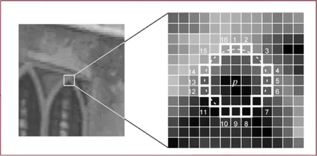
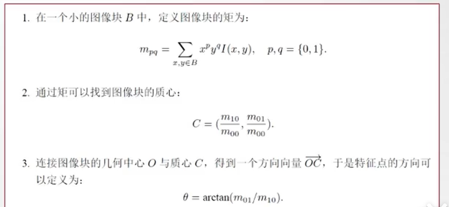

### 一、ORB特征是什么？

ORB特征，全称是 **Oriented FAST and Rotated BRIEF**，即“带方向的FAST角点 + 旋转后的BRIEF描述子”。你可以把它理解为一个图像的“关键点”加上这个关键点的“身份证”。

它实际上是由两部分组成的：

1.  **关键点（Keypoint）- FAST角点**：
    *   **基础**：使用**FAST**算法来快速寻找图像中的角点（一个点与周围的点相差超过一定值）。角点通常是物体边缘的拐角处，这些地方具有丰富的纹理信息，容易被识别和匹配。
    
    *   **改进**：原始的FAST角点没有方向（或称“主方向”）信息，也不具备尺度不变性。ORB对此进行了改进：
        *   **尺度不变性**：通过构建图像金字塔（即同一张图像的不同尺寸版本），在不同尺度的图像上检测角点，使得算法能够在相机远近变化时仍能检测到同一个点。
        *   **方向（主方向）**：通过计算角点所在区域的图像矩（Intensity Centroid）来确定其主方向。这使得ORB特征具有了**旋转不变性**——即使图像发生了旋转，我们也能找到它。
        

2.  **描述子（Descriptor）- BRIEF描述子**：
    *   **基础**：使用**BRIEF**算法来为每个关键点生成一个简短的“身份证号码”。这个“身份证”是通过在关键点周围区域随机选取若干对像素点，比较它们的灰度值大小（例如，如果点A的灰度大于点B，则记为1，否则记为0），最终得到一个由0和1组成的二进制串（比如256位）。
    *   **改进**：原始的BRIEF描述子对旋转非常敏感。ORB利用上面计算得到的**关键点主方向**，将BRIEF的描述子“旋转”到同一个方向上来计算。这就是其全名中 **“Rotated BRIEF”** 的由来，这极大地提升了描述子对图像旋转的鲁棒性。

**总结一下**：ORB特征 = **oFAST**（带方向和尺度的FAST关键点） + **rBRIEF**（旋转后的BRIEF描述子）。

---

### 二、ORB特征有什么用？

ORB特征的设计目标就是为了**快速、可靠地进行图像特征匹配**。它在SLAM和计算机视觉领域有着至关重要的作用：

#### 1. **特征匹配与跟踪**
这是最核心的用途。在ORB-SLAM中，算法需要在连续帧的图像中找到同一个物理点。
*   **如何工作**：计算当前帧和上一帧（或地图中）的ORB特征，然后将它们的二进制描述子进行比较（使用**汉明距离**——即计算两个二进制串有多少位不同，不同越少，越相似）。
*   **作用**：通过这种匹配，系统可以知道“上一帧的这个点，就是当前帧的那个点”。基于这些匹配点对，就可以估算出相机自身的运动（位姿）。

#### 2. **重定位**
当相机运动过快或被遮挡导致跟踪失败时，系统会“跟丢”。
*   **如何工作**：系统会将当前看到的图像与之前建立的所有关键帧进行ORB特征匹配。
*   **作用**：一旦找到匹配度很高的旧关键帧，系统就能立刻知道自己现在身处何处，从而实现快速重定位，回到正确的跟踪轨迹上。

#### 3. **回环检测**
这是SLAM中消除累积误差的关键技术。当相机回到一个之前访问过的地方时，系统需要识别出来。
*   **如何工作**：与重定位类似，通过将当前帧的ORB特征与所有历史关键帧的ORB特征进行匹配。
*   **作用**：如果系统发现当前场景与一个非相邻的旧关键帧高度匹配，它就检测到了一个“回环”。随后，系统会优化整个地图和运动轨迹，将累积的误差“摊平”，从而得到全局一致的地图。

#### 4. **地图构建**
在建立稀疏地图时，地图中的点（地图点）本身就是由ORB特征构成的。每个地图点都存储了它被多个关键帧观测到的平均ORB描述子，方便后续的匹配和识别。

---

### 一、BA是什么？一个直观的理解

**Bundle Adjustment**，中文常翻译为**“光束法平差”** 或 **“捆绑调整”**。这个名字来源于其物理含义：将相机光心（一个点）和场景中的三维点（另一个点）连成一条“光束”，然后调整（Adjustment）这些光束的端点（即相机位姿和三维点位置），使得所有光束都能完美地、无误差地穿过其在图像中对应的像素点。

**一个简单的比喻：**
想象一下，你从不同角度给同一个物体拍了很多张照片。现在，你的任务是：
1.  确定这个物体的精确三维形状。
2.  确定你每次拍照时所站的位置和相机的朝向。

BA要做的就是**同时、一起优化这两件事**。它通过不断微调物体的三维点和你拍照的位姿，使得“从你拍照的位置，看到的三维物体，应该正好投影到你的照片上”这个关系达到最完美的吻合。

从数学上讲，BA是一个大规模的**非线性最小二乘优化问题**。它的目标是**最小化“重投影误差”**。

---

### 二、核心概念：重投影误差

**重投影误差**是BA的灵魂，也是它要最小化的目标。

*   **是什么**：一个三维地图点，根据当前估计的相机位姿，被**投影**到图像平面上，会得到一个**计算出的像素坐标**。这个计算出的坐标，与该地图点**实际被观测到的像素坐标**之间的差值，就是重投影误差。
*   **直观理解**：比如一个三维点，在照片A中出现在(100, 200)这个像素位置。但根据我们当前估计的相机位姿和这个三维点的位置，通过相机投影模型计算出的投影坐标却落在了(102, 198)的位置。这个(2, -2)的偏差就是重投影误差。
*   **目标**：BA的目标就是调整所有相机位姿和所有三维点位置，使得**所有这样的误差的平方和达到最小**。

---

### 三、BA有什么用？

BA是保证SLAM和三维重建**精度**的核心环节，其主要作用如下：

#### 1. **全局优化与消除累积误差**
*   在SLAM过程中，随着机器人的运动，位姿估计的误差会不断累积，导致地图扭曲和轨迹漂移。
*   BA通过回顾所有已有的观测数据（所有相机位姿看到的所有地图点），进行一次全局性的调整，能够有效地“摊平”这些累积误差，得到一个**全局一致**的地图和轨迹。这是**回环检测**后必不可少的一步，用于校正因长时间运行而产生的巨大漂移。

#### 2. **精细化地图构建**
*   无论是稀疏特征点地图（如ORB-SLAM）还是稠密/半稠密地图，BA都能显著提高地图点的三维坐标精度。通过优化，地图点的位置会更加准确，从而得到更高质量的环境模型。

#### 3. **提高位姿估计精度**
*   通过融合多帧的观测信息来联合优化，BA得到的相机位姿比只依赖相邻两帧的视觉里程计要**精确和稳定得多**。

---

### 四、BA在SLAM中的具体应用场景

在像ORB-SLAM这样的系统中，BA并不是每一帧都运行的，因为它的计算量很大。通常会在以下关键节点触发：

1.  **局部BA**：
    *   当新的关键帧加入时，系统会启动一个局部BA。它优化**最近的一系列关键帧**以及这些关键帧观测到的**所有地图点**。
    *   **作用**：在保证实时性的同时，持续地对局部地图进行精细化，防止误差过快累积。

2.  **全局BA**：
    *   当**检测到回环**时，系统会启动一个全局BA。它优化**所有的关键帧位姿和所有的地图点**。
    *   **作用**：这是威力最强大的优化，能够彻底地校正整个运行过程中产生的所有累积误差，是保证SLAM系统长期运行精度的关键。

3.  **仅位姿图优化**：
    *   有时，为了降低计算量，在回环后只优化关键帧的**位姿**，而固定地图点的位置。这是一种简化版的BA。

---

### 总结

| 特性 | 描述 |
| :--- | :--- |
| **本质** | 一个大规模非线性最小二乘优化问题。 |
| **目标** | **最小化重投影误差**。 |
| **优化对象** | **同时优化相机位姿（旋转和平移）和三维地图点的坐标**。 |
| **核心作用** | **提高精度**：消除累积误差，得到全局一致的最优估计。 |
| **在SLAM中地位** | 是SLAM后端优化的核心，是保证系统高精度的“定海神针”。 |

---

### 共视关系思想

这句话承认了系统建立在两个被证明非常有效的前人思想之上：

1.  **基于共视关系的局部地图**
    *   **“共视关系”**：指的是两个关键帧能看到许多相同的三维地图点。如果两个关键帧看到很多相同的地图点，它们就是“共视”的。
    *   **“局部地图”**：在追踪当前相机位置时，系统并不使用整个全局地图（那样效率太低），而是专注于一个**局部窗口**内的地图。这个窗口通常包括：
        *   与当前帧共视程度最高的**关键帧 K**。
        *   所有与关键帧 K 有共视关系的**其他关键帧**。
        *   这些关键帧所观测到的**所有地图点**。
    *   **优点**：这样做极大地减少了计算量，使系统能够实时运行，同时保证了优化的准确性和稳定性，因为它包含了与当前视角最相关的环境信息。

2.  **从共视图构建姿态图**
    *   **“共视图”**：这是一个图结构，其中**节点**是关键帧，如果两个关键帧之间存在共视关系（共享一定数量的地图点），它们之间就有一条**边**连接。边的权重可以是共视地图点的数量。
    *   **“姿态图”**：这是一个简化版的图优化模型，用于全局优化。在这里，**节点**是相机位姿（姿态），**边**则代表两个位姿之间的相对变换约束。
    *   **如何构建**：系统直接从**共视图**中提取拓扑结构来构建**姿态图**。共视图中连接关键帧的边，在姿态图中就变成了连接两个位姿节点、并带有相对运动估计的约束边。
    *   **优点**：这为高效的**回环检测**和**全局优化**奠定了基础。当检测到回环时，系统会添加一条新的边连接回环两端的关键帧，然后优化整个姿态图，以校正累积的位姿误差。

**简单来说，这两点“优秀思想”的核心是：利用关键帧之间“看见共同点”这一简单关系，来智能地管理计算资源，实现局部的高效追踪和全局的一致性优化。**

---

### 核心思想：ORB特征三位一体的特征复用

**用于追踪相机位置和构建地图的同一种ORB特征，同时也被直接用来进行位置识别（包括重定位和回环检测）**。

---

### 1. 传统做法 vs ORB-SLAM的做法

#### **传统做法（或某些其他系统）**
*   **特征“分离”**：系统可能会使用不同的特征来处理不同的任务。例如：
    *   使用**SIFT**或**SURF**这类鲁棒性更高但计算慢的特征进行**位置识别（回环检测/重定位）**。
    *   使用**FAST**这类计算快的特征进行**相机追踪**。
*   **带来的问题**：
    *   **效率低下**：需要为同一幅图像计算两套不同的特征，计算开销大。
    *   **数据关联复杂**：两套特征之间需要建立联系，增加了系统复杂性。

#### **ORB-SLAM的做法**
*   **特征“统一”**：自始至终只使用**ORB**这一种特征。
    *   **追踪**：匹配当前帧和上一帧的ORB特征来跟踪相机运动。
    *   **建图**：将稳定的ORB特征点三角化，成为三维地图点。
    *   **位置识别**：使用同一个ORB特征数据库进行重定位和回环检测。

---

### 2. 这种设计带来的巨大优势

#### **优势一：极高的效率**
*   **计算一次，多处使用**：系统只需要为每一帧图像计算一次ORB特征。这些特征随后被用于跟踪、局部建图和位置识别等所有模块。这极大地节省了计算资源，是保证系统能够实时运行的关键。

#### **优势二：避免了“深度插值”的麻烦和误差**
这是这句话后半段 **“避免了像前人工作那样从附近的SLAM特征插值计算识别特征的深度”** 所强调的重点。

*   **场景还原**：假设一个系统用SIFT特征做回环检测，用ORB特征做SLAM。当它通过SIFT特征识别出一个回环时，它遇到了一个问题：**这个SIFT特征点没有对应的三维坐标（深度）**，因为它没有被用于建图。
*   **传统的解决方案（深度插值）**：为了利用这个回环约束，系统不得不这样做：
    1.  找到这个SIFT特征点**附近**的、有深度的ORB特征点。
    2.  根据这些邻近的ORB地图点的深度，**估算（插值）** 出这个SIFT特征点的深度。
*   **插值带来的问题**：
    *   **引入误差**：插值本身就是一种估计，不精确。尤其是在深度不连续的区域（如物体边缘），插值会产生很大误差。
    *   **系统复杂**：需要额外实现一套插值逻辑，增加了代码复杂度和不确定性。

*   **ORB-SLAM的优雅解决方案**：
    由于回环检测用的ORB特征**本身就是地图点**，每一个用于识别的特征都**天然拥有一个已经通过三角化或优化得到的、精确的三维坐标**。当系统检测到回环时，它可以直接、无缝地建立起**二维像素（当前帧的ORB特征）到三维地图点（数据库中的ORB地图点）** 的精确对应关系，无需任何插值，从而创建出更准确、更强大的回环约束。

### 总结

**通过系统层面的精巧设计，将核心数据（ORB特征）的价值最大化。**

这种“三位一体”的特征复用机制带来了：
*   **高效**：节省计算。
*   **精确**：避免插值误差。
*   **简洁**：系统架构清晰统一，模块间耦合紧密。
*   

---

### 核心思想：用“视觉单词”快速识别场景——词袋模型

#### 详细分解

**第一句："The system has embedded a bags of words place recognition module, based on DBoW2, to perform loop detection and relocalization."**

*   **说明**：系统内置了一个**词袋模型位置识别模块**，这个模块基于**DBoW2库**（一个开源C++库）。它的两个核心任务是：
    *   **回环检测**：判断相机是否回到了之前到过的地方。
    *   **重定位**：当相机跟踪失败后，重新确定自己在地图中的位置。

**第二句："Visual words are just a discretization of the descriptor space, which is known as the visual vocabulary."**

*   **说明**：**视觉单词**是对**特征描述子空间**的**离散化**。（感觉像词嵌入）
    *   **理解**：一个ORB描述子是一个256位的二进制串，它存在于一个巨大的、拥有2^256种可能的空间里。“视觉单词”就是把这个巨大的空间划分成许多个“小块”（聚类），每个“小块”就是一个“视觉单词”。所有这些“小块”的集合，就构成了一个 **“视觉词汇表”**。

**第三句："The vocabulary is created offline with the ORB descriptors extracted from a large set of images."**

*   **说明**：这个**视觉词汇表是离线创建**的。
    *   **如何创建**：从一个**大型的、通用的**图像数据集（例如，来自谷歌街景或各种室内外场景的图片）中提取海量的ORB描述子。然后使用**聚类算法**（如K-Means）将这些描述子聚合成成千上万个类，每一个类就是一个“视觉单词”。这个过程的产物就是词汇表，它是一个`.yml`或`.txt`文件，在ORB-SLAM系统运行前就已经加载好。

**第四句："If the images are general enough, the same vocabulary can be used for different environments getting a good performance..."**

*   **说明**：只要用于创建词汇表的图像**足够通用和多样化**，那么同一个词汇表就可以用于各种不同的新环境（比如，用一个在城市街景上训练的词汇表去跑一个室内环境），并且能取得很好的效果。这体现了该方法的**强泛化能力**。

**第五句和第六句："The system builds incrementally a database that contains an invert index, which stores for each visual word in the vocabulary, in which keyframes it has been seen, so that querying the database can be done very efficiently."**

*   **这是最关键的部分，解释了在线运行的机制：**
    1.  **数据库**：当ORB-SLAM运行时，它会为当前地图**增量地构建一个数据库**。
    2.  **倒排索引**：这个数据库的核心是一个**倒排索引**。
        *   **正排索引**：是“关键帧 -> 包含了哪些视觉单词”（就像一本书的每一页后面列出了本页的关键词）。这很容易得到。
        *   **倒排索引**：是“**视觉单词 -> 哪些关键帧包含了我**”（就像全书的索引，“大象” -> 页码 45, 78, 132）。
    3.  **高效查询**：当有一帧新的图像（查询帧）进来时，系统提取其ORB特征，并将其转换成“视觉单词包”。然后，通过查询倒排索引，可以**瞬间**知道哪些历史关键帧包含了与当前帧相同的视觉单词。共享单词越多，说明这两帧越相似。这个过程非常快，可以达到帧率级别的识别速度。

**最后一句："The database is also updated when a keyframe is deleted by the culling procedure."**

*   **说明**：为了控制内存和保持效率，ORB-SLAM会**剔除**一些冗余或不好的关键帧。当一个关键帧被删除时，系统也会**同步更新词袋数据库**，将倒排索引中与该关键帧相关的所有条目移除，确保数据库的简洁和准确。

#### 总结与比喻

让我们用**百科全书索引**的比喻来完整回顾一下：

| **ORB-SLAM 词袋模型** | **百科全书索引** |
| :--- | :--- |
| **视觉词汇表** | **索引表**（例如，所有英文单词的列表） |
| **ORB描述子** | **书中的具体措辞** |
| **视觉单词** | **索引中的一个词条**（如“大象”） |
| **关键帧** | **书的页码** |
| **词袋数据库** | **制作完成的完整索引** |
| **倒排索引** | **索引中“词条->页码”的映射关系** |
| **查询一帧图像** | **查找“大象”这个词** |
| **识别结果** | **得到所有包含“大象”的页码（45, 78, 132）** |

**整个流程就是：**
1.  **离线准备**：制作一本通用的“词典”（视觉词汇表）。
2.  **在线建库**：随着SLAM运行，为看到每一个关键帧（新页码）制作索引，记录下“哪些关键词出现在哪些页码”（倒排索引）。
3.  **快速查询**：当看到一个新场景时，提取出它的“关键词”（视觉单词包），然后去索引里瞬间反查可能匹配的“页码”（历史关键帧），从而完成回环检测或重定位。

这种基于词袋模型的方法，是ORB-SLAM能够实现高效、准确的长期SLAM的关键技术之一。

---

### AUTOMATIC MAP INITIALIZATION —— 从帧到相机姿态和三维地图

#### **原理1：对极几何——恢复相机运动**

对极几何描述的是两个相机视角之间的内在射影几何关系。

*   **核心约束**：一个三维点 \( P \) 在参考帧 \( F_r \) 中的投影点 \( x_r \)，和在当前帧 \( F_c \) 中的投影点 \( x_c \)，必然满足以下约束：
    \[
    \mathbf{x}_c^T \mathbf{F} \mathbf{x}_r = 0
    \]
    其中，\( \mathbf{F} \) 就是**基础矩阵**。

*   **如何恢复运动？**
    1.  **从匹配点计算 F**：通过像RANSAC这样的鲁棒算法，从大量的 \( x_r \leftrightarrow x_c \) 匹配点对中，估算出最可能的 \( \mathbf{F} \) 矩阵。
    2.  **从 F 到 E**：在相机已标定（内参矩阵 \( K \) 已知）的情况下，基础矩阵 \( F \) 可以转换为**本质矩阵 \( E \)**：
        \[
        \mathbf{E} = \mathbf{K}^T \mathbf{F} \mathbf{K}
        \]
    3.  **从 E 分解出 R 和 t**：对本质矩阵 \( E \) 进行奇异值分解（SVD），可以恢复出两个相机之间的**相对旋转 \( R \)** 和**相对平移 \( t \)**（最多会得到4种可能的解）。

*   **单应矩阵 H 的备选路径**：
    如果场景是平面的，则两帧之间的关系可以用**单应矩阵 \( H \)** 来描述：\( \mathbf{x}_c = \mathbf{H} \mathbf{x}_r \)。同样，从 \( H \) 也可以分解出 \( R \) 和 \( t \)。这就是ORB-SLAM要并行计算 \( H \) 和 \( F \) 的原因，并根据得分 \( R_H \) 选择更合适的模型。

#### **原理2：三角测量——恢复三维结构**

一旦我们得到了两个相机之间的相对运动 \( R \) 和 \( t \)，我们就可以恢复地图点的三维坐标。

*   **原理**：对于一个匹配点对 \( x_r \leftrightarrow x_c \)，我们知道了它们各自对应的相机光心 \( O_r \) 和 \( O_c \)，以及它们对应的相机朝向（射线）。三维点 \( P \) 必须同时位于这两条射线上。
*   **数学求解**：通过构建一个超定方程组，求解点 \( P \) 的三维坐标，使得它投影回两个图像平面时，与观测到的 \( x_r \) 和 \( x_c \) 的误差最小。
*   **筛选**：三角化后，会进行严格的筛选，只保留**深度值为正**（点在相机前方）、**重投影误差小**且**视差足够大**（确保深度估计可靠）的三维点。

#### **原理3：Bundle Adjustment——联合优化**

通过前两步得到的三维点和相机姿态是初步的，存在误差。**Bundle Adjustment（BA）** 是确保高精度的最后一步，也是最重要的一步。

*   **目标**：同时优化所有**相机姿态参数（\( R, t \）** 和**所有三维点坐标（\( P \）**，使得一个统一的代价函数最小化。
*   **代价函数**：**重投影误差的总和**。
    \[
    \min \sum \| \text{观测到的像素坐标} - \text{投影（估计的相机姿态， 估计的三维点）} \|^2
    \]
*   **在初始化中的作用**：初始化的最后一步是**全局BA**，它会对两个相机姿态和所有初始三角化的地图点进行联合优化，得到一个在整体上最一致、最精确的初始地图。

#### 总结

整个过程可以概括为：

1.  **选择参考帧**：动态选择一对具有足够视差和匹配点的图像帧（\( F_r \) 和 \( F_c \)）。
2.  **恢复运动**：利用**对极几何**原理，从匹配点中估算出**基础矩阵 F** 或**单应矩阵 H**，并分解得到两帧之间的**相对相机运动（\( R, t \）**。
3.  **恢复结构**：利用已知的相机运动，通过**三角测量**方法，计算匹配特征点对应的**三维点云**。
4.  **联合优化**：通过**Bundle Adjustment**同时优化相机姿态和三维点云，最小化重投影误差，得到精确可靠的**初始地图**。

这个从2D图像序列到3D地图和相机轨迹的流程，是整个视觉SLAM系统的基石。ORB-SLAM后续的跟踪、局部建图和回环检测，都是在这个初始地图的基础上进行的增量式和全局式的扩展与优化。

### **Tracking（跟踪）线程**

Tracking线程的目标是：**对于每一帧新来的图像，以最高的效率和鲁棒性计算出相机的6自由度姿态（位置和朝向）。**

---

#### 1. ORB特征提取

这是所有后续处理的基础。ORB-SLAM追求的是**均匀且充分**的特征分布，以提升跟踪的鲁棒性。

*   **尺度不变性**：采用8层图像金字塔，尺度因子为1.2，以检测不同尺度的特征。
*   **数量自适应**：
    *   标准分辨率（如512×384 ~ 752×480）：提取1000个角点。
    *   高分辨率（如KITTI的1241×376）：提取2000个角点。
*   **均匀化策略**：将每个金字塔层级**划分成网格**，并尝试在每个网格中提取至少5个角点。
    *   **自适应阈值**：如果某个网格中提取的角点不足，则**降低FAST角点检测的阈值**，以便在该区域检测到更多角点。
    *   **重新分配**：如果某些网格因缺乏纹理而始终无法提取角点，则将它们的配额分配给其他能提取到角点的网格。
*   **计算描述子**：为所有保留的FAST角点计算方向和ORB描述子。

**与PTAM的区别**：PTAM使用图像块进行相关匹配，而ORB-SLAM在所有环节都使用ORB描述子，保证了系统的一致性和效率。

---

#### 2. 初始姿态估计

系统根据上一帧的跟踪状态，采用两种不同的策略来获取当前帧相机姿态的初始估计。

##### A. 从上一帧跟踪（主流、快速路径）

如果上一帧跟踪成功，系统假设相机运动是平滑的。

*   **恒速运动模型**：直接使用上一帧与上上帧之间的相对运动，来预测当前帧的相机姿态。
*   **引导搜索**：根据预测的姿态，将上一帧中观测到的地图点投影到当前帧的预测位置上，然后在投影点**附近的一个小窗口**内搜索匹配。这大大减少了匹配的搜索范围，提升了效率和鲁棒性。
*   **姿态优化**：利用找到的匹配点，通过 **Motion-only Bundle Adjustment** 来优化当前帧的相机姿态。这个优化只调整相机的旋转和平移，而固定所有地图点的位置，最小化重投影误差。

> **备用方案**：如果运动模型明显不准（例如，突然的快速运动），导致匹配数不足，系统会放宽搜索范围，在上一帧地图点位置的周围进行一个更宽的搜索，然后再次优化姿态。

##### B. 全局重定位（挽救路径）

当跟踪丢失时（例如，相机被严重遮挡或快速运动导致运动模型完全失效），系统会启动全局重定位。

1.  **词袋查询**：将当前帧转换为词袋向量，并在识别数据库中查询最相似的**关键帧候选集**。
2.  **特征匹配**：与所有候选关键帧中未被匹配的地图点进行ORB特征匹配（使用词汇树加速）。
3.  **PnP RANSAC**：对每一个候选关键帧，使用RANSAC方案并结合PnP算法，迭代地求解相机姿态。
4.  **位姿优化与搜索**：如果某个候选关键帧通过PnP找到了一个具有足够内点（与当前几何模型假设一致的数据点）支持的姿态，则对该姿态进行优化，并在此基础上进行引导搜索，寻找更多匹配。
5.  **恢复跟踪**：如果优化后的姿态有足够的内点支持，则跟踪恢复，系统继续工作。

---

#### 3. 跟踪局部地图

在获得初始姿态和少量匹配后，这一步旨在通过融入更多地图信息来**精细化相机姿态**。

1.  **定义局部地图**：为了控制计算复杂度，并不使用整个地图。局部地图包括：
    *   **集合 \(\mathcal{K}_1\)**：与当前帧共享地图点的所有关键帧。
    *   **集合 \(\mathcal{K}_2\)**：在共视图中与 \(\mathcal{K}_1\) 相邻的关键帧。
    *   这些关键帧所观测到的**所有地图点**。

2.  **地图点投影与匹配**：将局部地图中的所有地图点投影到当前帧，并执行严格的筛选，只对可能可见的点进行匹配：
    *   **图像边界测试**：丢弃投影到图像外的点。
    *   **视角测试**：丢弃当前视角与地图点平均视角方向夹角大于60度的点。
    *   **尺度一致性测试**：丢弃距离相机太近或太远，超出地图点尺度不变性范围的点。
    *   **遮挡判断**：计算地图点在当前帧的预测尺度，并在该尺度的图像金字塔层级上，与附近仍未匹配的ORB特征进行匹配。

3.  **姿态优化**：使用所有找到的匹配（包括初始估计阶段找到的和本阶段新找到的），再次运行 **Motion-only BA**，得到最终优化的相机姿态。

---

#### 4. 新建关键帧决策

这是跟踪线程的最后一个步骤，它决定是否将当前帧作为关键帧传递给局部建图线程。

**设计哲学**：由于局部建图线程有剔除冗余关键帧的机制，跟踪线程可以**尽可能积极地插入关键帧**。这尤其有助于应对剧烈的旋转运动，因为旋转会快速导致特征丢失，而新的关键帧能及时“锁定”新的场景信息。

**必须同时满足的所有条件**：
1.  **自上次重定位后已过至少20帧**：确保系统在重定位后已经进入稳定状态。
2.  **局部建图线程空闲，或自上次关键帧插入后已过至少20帧**：控制关键帧的频率，避免给后端带来过大负担。
3.  **当前帧跟踪至少50个点**：确保跟踪质量足够好。
4.  **当前帧跟踪的点数少于参考关键帧 \(K_{\text{ref}}\) 的90%**：这是最关键的条件，它确保了有**足够的视觉变化**，而不是基于简单的距离判断。这表明当前帧看到了许多新的内容，值得成为一个关键帧。

如果局部建图线程正忙，但条件2的后半部分满足（超过20帧），跟踪线程会发送一个信号，请求停止当前的局部BA，以便局部建图线程能尽快处理新的关键帧。

#### 总结

ORB-SLAM的跟踪线程是一个设计极其精密的流程，它通过：
*   **多假设的初始估计**（运动模型 vs 重定位）来应对不同的运动场景。
*   **由粗到精的优化策略**（初始估计 -> 局部地图跟踪）来逐步精细化姿态。
*   **积极主动的关键帧决策**来保证地图的及时更新和系统的长期鲁棒性。
*   **对局部地图的充分利用**来提升姿态估计的精度和稳定性。

### **Local Mapping（局部建图）线程** 

**Local Mapping 线程的使命**：处理由Tracking线程插入的**新关键帧**，通过一系列精细操作，**扩充**地图（三角化新点）、**优化**地图（局部BA），并**剔除**冗余结构（关键帧与地图点），确保局部地图的质量和效率。

---

#### 1. 关键帧插入

这是局部建图线程对新关键帧的“注册”过程。

*   **更新共视图**：在共视图添加一个新节点（代表新关键帧 \( K_i \)），并创建与所有能观测到相同地图点的其他关键帧的边。边的权重是共享地图点的数量。
*   **更新生成树**：将新关键帧 \( K_i \) 连接到与它共享最多地图点的那个关键帧上，以维持一个覆盖所有关键帧的最小连接树。
*   **计算词袋表示**：为 \( K_i \) 计算其词袋向量。这个表示对于后续的数据关联（特别是在三角化新点时快速匹配特征）至关重要。

---

#### 2. 近期地图点剔除

这是一个**严格的“试用期”机制**，旨在在早期就剔除掉那些质量不高或可能是外点的地图点，防止它们污染后续的优化。

一个地图点必须在其创建后的**最初三个关键帧**期间通过以下测试，否则将被移除：

1.  **可跟踪性测试**：在SLAM的实际运行中，Tracking线程必须在**超过25%的帧**中成功匹配到该点。（这些帧是指在该点被预测为可见的帧中。）
2.  **多视角一致性测试**：如果自该点创建后已经过去了多于一个关键帧，那么它**必须被至少三个关键帧**观测到。

**一旦通过此测试**，该地图点就成为“正式”地图点，此后只有在它被少于三个关键帧观测到时（例如，由于关键帧被剔除或BA将其判为外点）才会被删除。

**设计哲学**：宁可错杀，不可放过。这个策略确保了ORB-SLAM的地图中包含的**异常值极少**。

---

#### 3. 新的地图点创建

此步骤旨在**丰富现有地图**，通过三角化来创建新的三维地图点。

*   **搜索范围**：在新关键帧 \( K_i \) 的所有**共视关键帧** \( \mathcal{K}_c \)（即在共视图中与之相连的关键帧）中进行。
*   **匹配策略**：
    *   对于 \( K_i \) 中每一个**未被匹配**的ORB特征，在其他共视关键帧中搜索**未被匹配**的ORB特征。
    *   使用**词袋模型**的“技巧”来加速匹配：将暴力匹配约束在词汇树同一节点的特征之间。
    *   对找到的匹配对，检查其是否满足**极线约束**，以剔除错误的匹配。
*   **三角化与验证**：对通过极线几何检查的ORB特征对进行三角化。新生成的三维点必须通过一系列严格的几何验证：
    *   **正深度**：在两个相机坐标系下深度都必须为正。
    *   **足够视差**：三角化时两观测射线之间必须有足够的夹角。
    *   **重投影误差**：投影回图像后，与原始特征点的距离要足够小。
    *   **尺度一致性**：在不同尺度上观测应是一致的。
*   **跨帧匹配**：新点最初由两个关键帧三角化而成，但会被**投影到所有共视关键帧**中，尝试寻找更多匹配，从而增强其稳定性。

---

#### 4. 局部Bundle Adjustment

这是局部建图线程中最核心的**优化步骤**，它负责精细化局部区域的结构和运动。

*   **优化变量**：
    *   **所有**当前正在处理的关键帧 \( K_i \)。
    *   **所有**与 \( K_i \) 在共视图中相连的关键帧 \( \mathcal{K}_c \)。
    *   **所有**被 \( K_i \) 和 \( \mathcal{K}_c \) 观测到的地图点。
*   **固定变量**：那些**能看到这些被优化地图点，但又不与 \( K_i \) 共视**的关键帧。它们被包含在优化中，但其位姿被固定。这提供了来自外部约束，防止优化漂移，同时又控制了计算规模。
*   **外点处理**：在优化过程中和优化结束后，那些重投影误差大的观测会被标记为外点并剔除。

通过这种设计，局部BA在**精度**和**效率**之间取得了完美的平衡。

---

#### 5. 局部关键帧剔除

这是为了保持地图**紧凑性**和实现**终身运行**的关键机制。其目标是删除冗余的关键帧，防止地图和优化问题无限增长。

*   **剔除标准**：检查所有与 \( K_i \) 共视的关键帧 \( \mathcal{K}_c \)，如果一个关键帧的**90%以上的地图点**都能在**至少其他三个关键帧**中，在**相同或更精细的尺度**上被观测到，那么它就被认为是冗余的。
*   **尺度条件的意义**：这确保了地图点保留的是那些对其测量最准确（在更精细尺度上观测）的关键帧。一个关键帧可能看到了很多点，但如果这些点在其他更近或更“正面”的视角下也能被看到，那么该关键帧就是冗余的。

**设计哲学**：在保证地图信息不丢失的前提下，用最少数量的关键帧来表达环境。这极大地降低了后端优化的复杂度，并使系统能够在同一环境中无限期运行，而不会因内存耗尽而崩溃。

#### 总结

Local Mapping线程是ORB-SLAM的**质量控制系统**。它通过一个精心设计的管道：
1.  **引入**新数据（关键帧插入）。
2.  **过滤**低质量元素（地图点剔除）。
3.  **扩充**地图内容（新点创建）。
4.  **精细化**局部模型（局部BA）。
5.  **压缩**数据结构（关键帧剔除）。

### **Loop Closing（回环检测）线程**

**Loop Closing 线程的使命**：消除累积误差，防止地图和轨迹随着时间推移而“漂移”得越来越严重。

---

#### 1. 回环候选检测

这是回环检测的第一步，旨在快速地从成千上万的关键帧中，找出几个与当前关键帧 \( K_i \) 看起来相似的可能候选。

*   **共视信息归一化**：
    1.  首先，计算 \( K_i \) 与其在**共视图**中所有邻居（共视程度 \( \theta_{min} = 30 \)）的词袋相似度得分。
    2.  保留其中的**最低得分** \( s_{min} \)。这个得分代表了“在当前位置附近，正常的关键帧应该有多像”。
*   **数据库查询**：用 \( K_i \) 的词袋向量查询整个识别数据库。
*   **候选筛选**：
    *   **得分过滤**：立即丢弃所有得分低于 \( s_{min} \) 的关键帧。这步操作类似于DBoW2中的分数归一化，但ORB-SLAM使用了更具语义的**共视信息**，而非时间相邻信息，从而能识别出在不同时间访问的同一地点。
    *   **共视过滤**：剔除所有与 \( K_i \) 直接相连的关键帧（它们是邻近帧，不是回环）。
*   **一致性验证**：为了应对感知歧义（多个地方看起来很像），系统要求必须**连续检测到三个一致的回环候选**（即这些候选关键帧在共视图中是相互连接的）。这极大地提升了检测的鲁棒性，避免单次误识别。

---

#### 2. 计算相似变换

在单目SLAM中，累积误差表现为7个自由度的漂移：3个平移、3个旋转和1个尺度。因此，ORB-SLAM使用**相似变换** 来建模回环两端之间的误差，这同时也是对回环的**几何验证**。

*   **3D-3D对应关系**：对于每一个回环候选关键帧 \( K_l \)，使用词袋模型加速的特征匹配方法，找到 \( K_i \) 和 \( K_l \) 之间通过地图点关联的**3D-3D对应点对**。
*   **RANSAC与Horn方法**：对每个候选，交替进行RANSAC迭代，使用**Horn的方法**[42]从3D-3D点对应关系中计算相似变换 \( \mathbf{S}_{il} \)。
    *   相似变换公式： \( \mathbf{X}_i = s\mathbf{R}\mathbf{X}_l + \mathbf{t} \)，其中 \( s \) 是尺度因子，\( \mathbf{R} \) 是旋转矩阵，\( \mathbf{t} \) 是平移向量。
*   **引导搜索与优化**：
    1.  如果找到一个具有足够内点的 \( \mathbf{S}_{il} \)，先对其进行优化。
    2.  利用优化后的变换进行**引导搜索**，寻找更多的3D-3D对应关系。
    3.  再次优化 \( \mathbf{S}_{il} \)。
*   **接受回环**：如果优化后的 \( \mathbf{S}_{il} \) 仍然有足够的内点支持，则正式接受 \( K_l \) 为回环关键帧。

---

#### 3. 回环融合

这一步是**校正地图和轨迹的开始**，目的是将回环两端“对齐”并合并重复的地图结构。

1.  **位姿传播校正**：
    *   使用计算出的相似变换 \( \mathbf{S}_{il} \) 直接校正当前关键帧 \( K_i \) 的位姿 \( \mathbf{T}_{iw} \)。
    *   将这个校正**传播**到 \( K_i \) 的所有邻居关键帧（通过串联变换），从而将回环的“当前这一侧”整体对齐到“历史那一侧”。
2.  **地图点融合**：
    *   将回环关键帧 \( K_l \) 及其邻居观测到的所有地图点，投影到 \( K_i \) 及其邻居的图像中。
    *   在投影点附近进行**窄窗口搜索**，寻找匹配。
    *   一旦找到匹配，就将这两个实际上代表同一个物理点的**重复地图点进行融合**（通常保留更古老、被更多观测的点，并合并其描述子和观测关系）。

---

#### 4. 本质图优化

回环融合在局部进行了校正，但误差需要**分布到整个轨迹**上。直接进行全局BA计算量太大，因此ORB-SLAM采用了一个轻量级的**位姿图优化**。

*   **优化图**：在 **Essential Graph** 上进行优化。这个图包含了生成树、高共视边（\( \theta_{min}=100 \)）和回环边，是一个既紧凑又包含足够约束的“强相机网络”。
*   **优化变量**：优化的是所有关键帧的**相似变换**（7自由度位姿），这专门用于校正单目SLAM的尺度漂移。
*   **误差函数**：优化成本函数基于相似变换的约束，确保回环两端的位姿在校正后能够一致，并将误差平滑地分摊到整个运动轨迹中。
*   **地图点校正**：优化后，每个地图点根据**观测它的其中一个关键帧**的校正量进行变换，使其与优化后的位姿保持一致。

---

#### 后续步骤：全局Bundle Adjustment

虽然论文在Loop Closing部分没有明确列出，但在系统架构中，在本质图优化之后，通常会启动一个**全局Bundle Adjustment**。

*   **目的**：位姿图优化只优化了关键帧位姿，固定了地图点。全局BA则**同时优化所有关键帧位姿和所有地图点**，是消除误差最彻底、最精确的步骤。
*   **运行方式**：由于计算量巨大，全局BA通常在一个**独立的线程**中运行，以免影响系统的实时性。在优化期间，系统可以继续跟踪和建图。

#### 总结

ORB-SLAM的回环检测模块是一个工业级的解决方案，它通过：
*   **外观识别**（词袋模型）与**几何验证**（相似变换）相结合，确保了回环检测的**高召回率**和**高精度**。
*   **多阶段优化**（融合 -> 本质图优化 -> 全局BA），以递进的方式有效地校正累积误差，平衡了**精度**和**效率**。
*   利用**共视信息**等高级技巧，提升了识别和验证的鲁棒性。

正是这个强大而精细的回环检测模块，使得ORB-SLAM能够实现**大规模、长时间、全局一致**的定位与建图，将其与单纯的视觉里程计系统区分开来，成为了一个完整的SLAM系统。