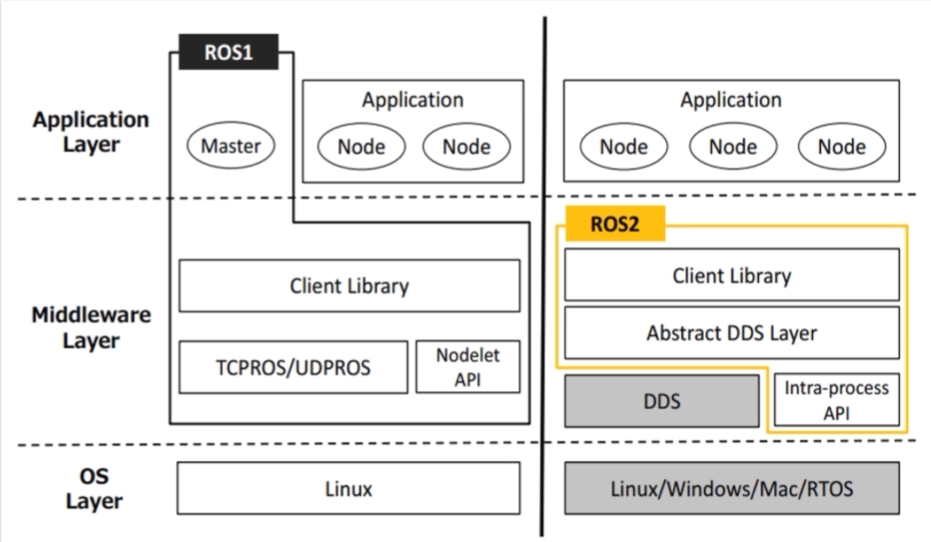
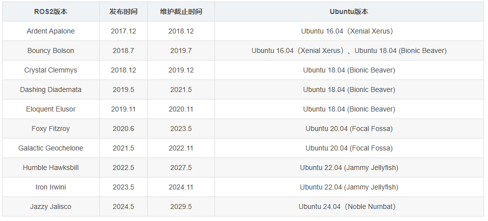
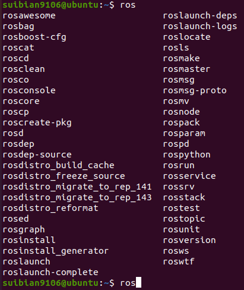
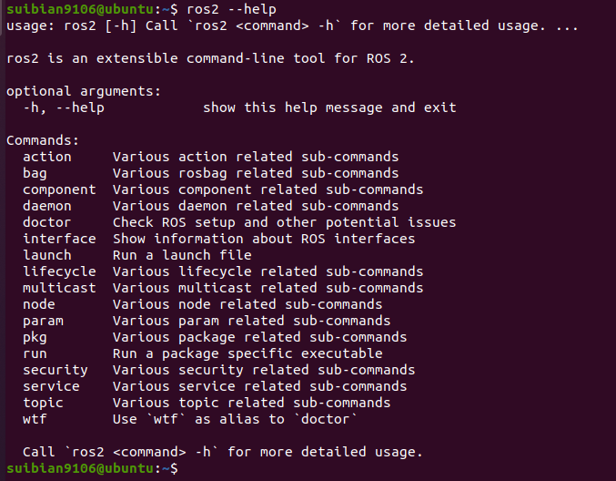

# ROS2
## ROS2 与 ROS1
ROS2和ROS1架构


**Nodelet API** 和 **Intra-process API** 是进程内以共享内存方式提供的通讯方法

**DDS（Data Distribution Service）**，即**数据分发服务**，是一个由**对象管理组织（OMG）** 发布的**开放式国际标准**。它是一种专为**高性能、实时、分布式**系统设计的**以数据为中心**的通信中间件协议和API标准。

应用程序不需要知道其他应用程序在哪里（IP地址、端口等），它们只需要**关心自己需要什么数据（订阅）或产生什么数据（发布）**。DDS负责高效、可靠、及时地将数据从生产者传递到所有需要它的消费者。

## ROS2 安装

ROS2与Ubuntu版本对应


* **设置编码**
```bash
$ sudo apt update && sudo apt install locales
$ sudo locale-gen en_US en_US.UTF-8
$ sudo update-locale LC_ALL=en_US.UTF-8 LANG=en_US.UTF-8 
$ export LANG=en_US.UTF-8
```
* **添加源**
```bash
$ sudo apt update && sudo apt install curl gnupg lsb-release 
$ sudo curl -sSL https://raw.githubusercontent.com/ros/rosdistro/master/ros.key -o /usr/share/keyrings/ros-archive-keyring.gpg 
$ echo "deb [arch=$(dpkg --print-architecture) signed-by=/usr/share/keyrings/ros-archive-keyring.gpg] http://packages.ros.org/ros2/ubuntu $(source /etc/os-release && echo $UBUNTU_CODENAME) main" | sudo tee /etc/apt/sources.list.d/ros2.list > /dev/null
```

* **安装ROS2**
```bash
$ sudo apt update
$ sudo apt upgrade
$ sudo apt install ros-foxy-desktop
```
* **设置环境变量**
```bash
sudo vim ~/.bashrc 
##在文件最后添加以下内容，使ROS1和ROS2共存
unset ROS_DISTRO
unset ROS_PACKAGE_PATH
unset ROS_VERSION
echo "ros noetic(1) or ros2 foxy(2)?"
read edition
if [ "$edition" -eq "1" ];then
  source /opt/ros/noetic/setup.bash
else
  source /opt/ros/foxy/setup.bash
fi
```

## 常用命令

ROS1命令行


ROS2命令行


---

### 启动命令

| 功能 | ROS1 (Noetic) | ROS2 (Foxy) | 说明 |
| :--- | :--- | :--- | :--- |
| **核心启动** | `roscore` | `ros2 daemon` (自动启动) | ROS2不再需要手动运行`roscore`，核心功能由守护进程（ros2 daemon）自动管理。 |
| **初始化环境** | `source /opt/ros/noetic/setup.bash` | `source /opt/ros/foxy/setup.bash` | 在每个终端中初始化ROS环境，以便使用ROS命令。 |
| **查看版本** | `rosversion -d` | `rosversion -d` | 查看已安装的ROS发行版名称。 |

---

### 工作空间与包管理

| 功能 | ROS1 (Noetic) | ROS2 (Foxy) | 说明 |
| :--- | :--- | :--- | :--- |
| **创建功能包** (C++) | `catkin_create_pkg <pkg_name> [deps]` | `ros2 pkg create --build-type ament_cmake <pkg_name>` | ROS2使用新的`ament`构建系统。 |
| **创建功能包** (Python) | `catkin_create_pkg <pkg_name> [deps]` | `ros2 pkg create --build-type ament_python <pkg_name>` | |
| **列出所有包** | `rospack list` | `ros2 pkg list` | |
| **查找包路径** | `rospack find <package_name>` | `ros2 pkg prefix <package_name>` | |
| **安装依赖** | `rosdep install -i --from-path src --rosdistro noetic -y` | `rosdep install -i --from-path src --rosdistro foxy -y` | `rosdep`命令在ROS1和ROS2中用法基本相同。 |

---

### 节点 (Nodes) 相关命令

| 功能 | ROS1 (Noetic) | ROS2 (Foxy) | 说明 |
| :--- | :--- | :--- | :--- |
| **运行节点** | `rosrun <pkg_name> <node_name>` | `ros2 run <pkg_name> <node_name>` | |
| **列出活动节点** | `rosnode list` | `ros2 node list` | |
| **查看节点信息** | `rosnode info <node_name>` | `ros2 node info <node_name>` | |
| **杀死节点** | `rosnode kill <node_name>` | (需在终端中 Ctrl+C) | ROS2中没有直接杀死远程节点的命令。 |

---

### 话题 (Topics) 相关命令

| 功能 | ROS1 (Noetic) | ROS2 (Foxy) | 说明 |
| :--- | :--- | :--- | :--- |
| **列出所有话题** | `rostopic list` | `ros2 topic list` | |
| **查看话题信息** | `rostopic info <topic_name>` | `ros2 topic info <topic_name>` | |
| **显示话题数据** | `rostopic echo <topic_name>` | `ros2 topic echo <topic_name>` | |
| **发布数据** | `rostopic pub [options] <topic_name> <msg_type> <data>` | `ros2 topic pub [options] <topic_name> <msg_type> <data>` | |

---

### 服务 (Services) 相关命令

| 功能 | ROS1 (Noetic) | ROS2 (Foxy) | 说明 |
| :--- | :--- | :--- | :--- |
| **列出所有服务** | `rosservice list` | `ros2 service list` | |
| **查看服务信息** | `rosservice info <service_name>` | `ros2 service info <service_name>` | |
| **调用服务** | `rosservice call <service_name> <arguments>` | `ros2 service call <service_name> <srv_type> <arguments>` | ROS2需要显式指定服务类型。 |
| **查看类型** | `rosservice type <service_name>` | `ros2 service type <service_name>` | |

---

### 参数 (Parameters) 相关命令

| 功能 | ROS1 (Noetic) | ROS2 (Foxy) | 说明 |
| :--- | :--- | :--- | :--- |
| **列出所有参数** | `rosparam list` | `ros2 param list` | |
| **获取参数值** | `rosparam get <param_name>` | `ros2 param get <node_name> <param_name>` | **关键区别**：ROS2需要指定拥有该参数的节点名。 |
| **设置参数值** | `rosparam set <param_name> <value>` | `ros2 param set <node_name> <param_name> <value>` | **关键区别**：ROS2需要指定节点名。 |
| **加载参数文件** | `rosparam load <file.yaml>` | `ros2 param load <node_name> <file.yaml>` | ROS2参数必须加载到特定节点。 |
| **转储参数文件** | `rosparam dump <file.yaml>` | `ros2 param dump <node_name> > <file.yaml>` | |

---

### 运行与启动文件 (Launch Files)

| 功能 | ROS1 (Noetic) | ROS2 (Foxy) | 说明 |
| :--- | :--- | :--- | :--- |
| **启动文件格式** | XML | XML, Python, YAML | ROS2**推荐使用Python**编写启动文件，功能更强大灵活。 | 
| **运行启动文件** | `roslaunch <pkg_name> <launch_file.launch>` | `ros2 launch <pkg_name> <launch_file>` | |

---

### 常用工具

| 功能 | ROS1 (Noetic) | ROS2 (Foxy) | 说明 |
| :--- | :--- | :--- | :--- |
| **可视化工具** | `rqt` (综合工具) / `rqt_graph` | `rqt` (综合工具) / `ros2 run rqt_graph rqt_graph` | RQT工具在ROS2中需要指定插件节点来运行。 |
| **查看计算图** | `rqt_graph` 或 `rosrun rqt_graph rqt_graph` | `ros2 run rqt_graph rqt_graph` | 查看节点、话题、服务的连接关系。 |
| **3D可视化工具** | `rviz` 或 `rosrun rviz rviz` | `ros2 run rviz2 rviz2` | 显示传感器数据（点云、图像、激光雷达）、机器人模型、TF变换等。 |
| **数据记录** | `rosbag record <topic_names>` | `ros2 bag record <topic_names>` | |
| **数据回放** | `rosbag play <bag_file>` | `ros2 bag play <bag_file>` | |
| **MAVROS** | `roslaunch mavros px4.launch fcu_url:=/dev/ttyACM0:57600` | `ros2 run mavros mavros_node --ros-args --param fcu_url:=/dev/ttyACM0:57600` | 飞控与ROS系统通信 |

---

### 动作 (Action) 相关命令——ROS2专有
查看动作列表：ros2 action list

查看动作信息：ros2 action info <action_name>

查看动作类型：ros2 action type <action_name>

发送动作目标：ros2 action send_goal <action_name> <action_type> <values>

---

## 通信方式——话题、服务、动作、参数
### 动作(action)——话题+服务

### 1. 动作（Action）

动作是 ROS 2 中一种**异步、长时运行（long-running）** 的通信机制。它被设计用来处理需要较长时间才能完成、并且可能需要定期反馈和可取消的任务。

你可以把它想象成一种**增强版的服务（Service）**：
*   **服务**：同步的请求-响应模式。
*   **动作**：异步的目标-反馈-结果模式。

#### 核心思想：一个动作由三个部分组成
1.  **目标（Goal）**：客户端希望服务器执行的任务（例如，“移动到坐标 (x, y, z)”）。
2.  **反馈（Feedback）**：服务器在执行任务过程中定期发送的进度更新（例如，“已完成 50%”、“检测到障碍物”）。
3.  **结果（Result）**：任务最终结束时（无论成功或失败），服务器发送的最终数据（例如，“成功到达目的地”或“因超时失败”）。

### 2. 动作的底层结构：Action Interface

和话题（`.msg`）和服务（`.srv`）一样，动作也使用接口定义文件（`.action`）来规范通信格式。一个 `.action` 文件分为三个部分，用 `---` 分隔：

```action
# Goal definition
# 定义目标的格式
geometry_msgs/PoseStamped target_pose
---
# Result definition
# 定义结果的格式
bool success
string message
---
# Feedback definition
# 定义反馈的格式
int32 percent_complete
geometry_msgs/Pose current_pose
```

*   第一部分：**目标** -> 客户端发送给服务器的数据。
*   第二部分：**结果** -> 任务结束后，服务器发送给客户端的数据。
*   第三部分：**反馈** -> 任务执行过程中，服务器定期发送给客户端的数据。


### 3. 动作的工作流程

#### 主要参与者：
*   **动作客户端（Action Client）**：发送目标、接收反馈和结果。
*   **动作服务器（Action Server）**：接收目标、执行任务、发送反馈和结果。

动作工作流程图


### 总结

| 特性 | 描述 |
| :--- | :--- |
| **本质** | 一种异步、双向的通信机制，用于处理长时间运行的任务。 |
| **核心组成** | **目标 (Goal)**、**反馈 (Feedback)**、**结果 (Result)**。 |
| **关键优势** | **提供进度反馈**、**支持任务取消**、**支持任务预占**。 |
| **适用场景** | 导航、抓取、大规模计算等任何非即时完成的任务。 |


## 话题 (topic) 代码示例

### 1.创建工作空间
```bash
mkdir -p ~/colcon_ws/src
cd ~/colcon_ws/src
```

### 2.创建功能包
```bash
#创建功能包，功能包包含源代码
cd ~/colcon_ws/src
ros2 pkg create --build-type ament_cmake learning_pkg_c #C++
ros2 pkg create --build-type ament_python learning_pkg_python #Python
```

  * C++功能包必然存在两个文件：`package.xml`和`CMakeLists.txt`
  * `package.xml`文件的主要内容如下，包含功能包的版权描述，和各种依赖的声明
  * `CMakeLists.txt`文件是编译规则

### 3.编写代码
在功能包的`src`文件夹中添加代码文件,`velocity_publisher.cpp`发布turtle的线速度和角速度，`pose_subscriber.cpp`订阅turtle的位置信息。

velocity_publisher.cpp
```C++
#include "rclcpp/rclcpp.hpp"
#include "geometry_msgs/msg/twist.hpp"

// 创建一个继承自rclcpp::Node的类
class VelocityPublisher : public rclcpp::Node
{
public:
    // 构造函数，初始化节点名称
    VelocityPublisher() : Node("velocity_publisher")
    {
        // 创建发布者，话题名/turtle1/cmd_vel，消息类型Twist，队列长度10
        publisher_ = this->create_publisher<geometry_msgs::msg::Twist>("/turtle1/cmd_vel", 10);
        
        // 创建定时器，设置回调函数和周期(10Hz)
        timer_ = this->create_wall_timer(
            std::chrono::milliseconds(100),  // 100ms = 10Hz
            std::bind(&VelocityPublisher::timer_callback, this));
    }

private:
    // 定时器回调函数，定期发布消息
    void timer_callback()
    {
        // 创建消息对象
        auto msg = geometry_msgs::msg::Twist();
        // 设置线速度和角速度
        msg.linear.x = 0.5;    // x方向线速度
        msg.angular.z = 0.2;   // z方向角速度
        
        // 发布消息
        publisher_->publish(msg);
        // 打印日志信息
        RCLCPP_INFO(this->get_logger(), "陀螺在旋转");
    }
    
    // 声明发布者和定时器
    rclcpp::Publisher<geometry_msgs::msg::Twist>::SharedPtr publisher_;
    rclcpp::TimerBase::SharedPtr timer_;
};

int main(int argc, char * argv[])
{
    // 初始化ROS 2
    rclcpp::init(argc, argv);
    
    // 创建节点并运行
    rclcpp::spin(std::make_shared<VelocityPublisher>());
    
    // 关闭ROS 2
    rclcpp::shutdown();
    return 0;
}
```

pose_subscriber.cpp
```C++
#include "rclcpp/rclcpp.hpp"
#include "turtlesim/msg/pose.hpp"

// 创建一个继承自rclcpp::Node的类
class PoseSubscriber : public rclcpp::Node
{
public:
    // 构造函数，初始化节点名称
    PoseSubscriber() : Node("pose_subscriber")
    {
        // 创建订阅者，话题名/turtle1/pose，队列长度10，设置回调函数
        subscription_ = this->create_subscription<turtlesim::msg::Pose>(
            "/turtle1/pose",
            10,
            std::bind(&PoseSubscriber::pose_callback, this, std::placeholders::_1));
    }

private:
    // 订阅回调函数，处理收到的消息
    void pose_callback(const turtlesim::msg::Pose::SharedPtr msg) const
    {
        // 打印收到的位置信息
        RCLCPP_INFO(this->get_logger(), "Turtle Pose: x:%0.6f y:%0.6f", msg->x, msg->y);
    }
    
    // 声明订阅者
    rclcpp::Subscription<turtlesim::msg::Pose>::SharedPtr subscription_;
};

int main(int argc, char * argv[])
{
    // 初始化ROS 2
    rclcpp::init(argc, argv);
    
    // 创建节点并运行
    rclcpp::spin(std::make_shared<PoseSubscriber>());
    
    // 关闭ROS 2
    rclcpp::shutdown();
    return 0;
}

```

* 修改`package.xml`文件,在`<buildtool_depend>ament_cmake</buildtool_depend>`下面添加需要的依赖
  ```xml
  <buildtool_depend>ament_cmake</buildtool_depend>

  <!-- 添加依赖 -->
  <depend>rclcpp</depend>
  <depend>geometry_msgs</depend>
  <depend>turtlesim</depend>
  ```
* 修改`CMakeLists.txt`文件，在对应位置加入如下代码
  ```
  # 添加依赖
  find_package(rclcpp REQUIRED)
  find_package(geometry_msgs REQUIRED)
  find_package(turtlesim REQUIRED)

  # 添加可执行文件
  add_executable(velocity_publisher src/velocity_publisher.cpp)
  ament_target_dependencies(velocity_publisher rclcpp geometry_msgs)

  add_executable(pose_subscriber src/pose_subscriber.cpp)
  ament_target_dependencies(pose_subscriber rclcpp turtlesim)

  # 添加 install 部分，以便 ros2 run 可以找到你的可执行文件
  install(TARGETS
    velocity_publisher
    pose_subscriber
    DESTINATION lib/${PROJECT_NAME})
  ```

### 4.编译
```bash
cd ~/colcon_ws/
colcon build
colcon build --packages-select your_package_name
```

### 5.设置环境变量
```bash
source ~/colcon_ws/install/setup.bash # 仅在当前终端生效
echo " source ~/colcon_ws/install/setup.bash" >> ~/.bashrc # 所有终端均生效
```

## 服务 (service) 代码示例

turtle_command_server.cpp
```C++
#include "geometry_msgs/msg/twist.hpp"
#include "rclcpp/rclcpp.hpp"
#include "std_srvs/srv/trigger.hpp"

using namespace std::chrono_literals;

// 全局变量，用于存储发布状态
bool pubCommand = false;

// 服务回调函数
bool commandCallback(
    const std::shared_ptr<std_srvs::srv::Trigger::Request> request,
    std::shared_ptr<std_srvs::srv::Trigger::Response> response) {

  pubCommand = !pubCommand; // 切换发布状态

  // 显示请求数据
  RCLCPP_INFO(rclcpp::get_logger("turtle_command_server"),
              "Publish turtle velocity command [%s]",
              pubCommand ? "Yes" : "No");

  // 设置反馈数据
  response->success = true;
  response->message = "Change turtle command state!";

  return true;
}

int main(int argc, char **argv) {
  // 初始化ROS2节点
  rclcpp::init(argc, argv);

  // 创建节点
  auto node = rclcpp::Node::make_shared("turtle_command_server");

  // 创建服务
  auto service = node->create_service<std_srvs::srv::Trigger>("/turtle_command",
                                                              commandCallback);

  // 创建发布器
  auto publisher =
      node->create_publisher<geometry_msgs::msg::Twist>("/turtle1/cmd_vel", 10);

  // 循环等待回调函数
  RCLCPP_INFO(node->get_logger(), "Ready to receive turtle command.");

  // 设置循环频率
  rclcpp::Rate loop_rate(10);

  while (rclcpp::ok()) {
    // 查看一次回调函数队列
    rclcpp::spin_some(node);

    // 如果标志为true，则发布速度命令
    if (pubCommand) {
      auto msg = geometry_msgs::msg::Twist();
      msg.linear.x = 0.5;
      msg.angular.z = 0.2;
      publisher->publish(msg);
    }

    loop_rate.sleep();
  }

  rclcpp::shutdown();
  return 0;
}
```

turtle_spawn.cpp
```C++
#include "rclcpp/rclcpp.hpp"
#include "turtlesim/srv/spawn.hpp"

using namespace std::chrono_literals;

int main(int argc, char **argv) {
  // 初始化ROS2节点
  rclcpp::init(argc, argv);

  // 创建节点
  auto node = std::make_shared<rclcpp::Node>("turtle_spawn");

  // 创建服务客户端
  auto client = node->create_client<turtlesim::srv::Spawn>("/spawn");

  // 等待服务可用
  while (!client->wait_for_service(1s)) {
    if (!rclcpp::ok()) {
      RCLCPP_ERROR(node->get_logger(),
                   "Interrupted while waiting for service.");
      return 1;
    }
    RCLCPP_INFO(node->get_logger(), "Service not available, waiting again...");
  }

  // 设置请求数据
  auto request = std::make_shared<turtlesim::srv::Spawn::Request>();
  request->x = 2.0;
  request->y = 2.0;
  request->name = "turtle2";

  // 发送请求并等待响应
  RCLCPP_INFO(node->get_logger(),
              "Call service to spawn turtle[x: %.2f, y: %.2f, name: %s]",
              request->x, request->y, request->name.c_str());

  auto result = client->async_send_request(request);

  // 等待响应结果
  if (rclcpp::spin_until_future_complete(node, result) ==
      rclcpp::FutureReturnCode::SUCCESS) {
    RCLCPP_INFO(node->get_logger(), "Spawn turtle successfully [name: %s]",
                result.get()->name.c_str());
  } else {
    RCLCPP_ERROR(node->get_logger(), "Failed to call service /spawn");
  }

  rclcpp::shutdown();
  return 0;
}
```