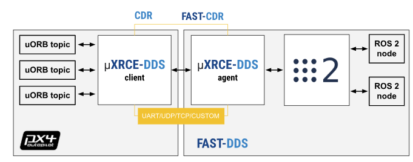

## mavros2
```bash
cd ./PX4-Autopilot
make px4_sitl_default gazebo
```

```bash
ros2 run mavros mavros_node --ros-args --param fcu_url:="udp://:14540@127.0.0.1:14557"
ros2 run mavros mavros_node --ros-args --param fcu_url:=/dev/ttyACM0:57600
```

```bash
ros2 run drone_control_cpp simple_controller
```


## px4_msgs 与 Micro XRCE-DDS Agent
[仿真环境配置教程](https://blog.csdn.net/m0_49214238/article/details/145987514)



[Micro XRCE-DDS 使用教程](https://docs.px4.io/main/en/middleware/uxrce_dds.html#starting-agent-and-client)
启用Micro XRCE-DDS Agent
```bash
#先启动Agent，再给Client上电或启动Client程序
#udp
MicroXRCEAgent udp4 -p 8888

#串口
MicroXRCEAgent serial --dev [串口设备文件] -b [波特率]
```

```bash
cd ./PX4-Autopilot
make px4_sitl_default gazebo
```

```bash
ros2 run drone_control_cpp simple_controller
```

[ros2 安装 Intel Realsense D435](https://blog.csdn.net/qq_43481447/article/details/130842883)
[VINS-Fusion-ROS2](https://github.com/zinuok/VINS-Fusion-ROS2)