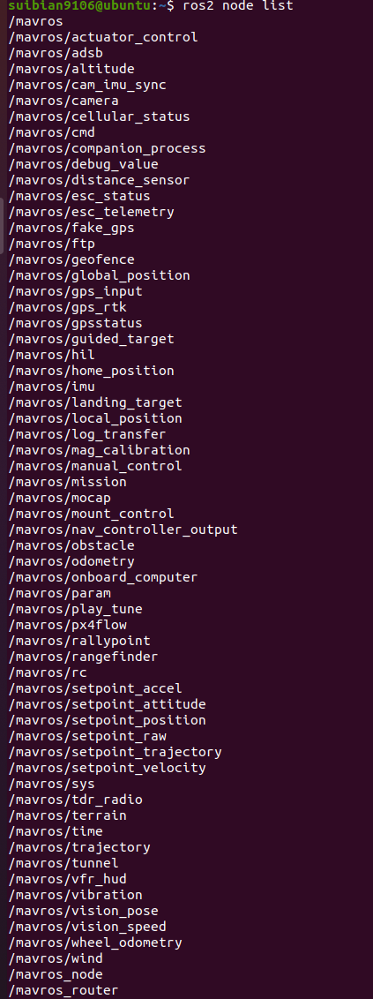
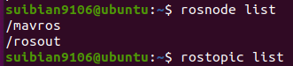
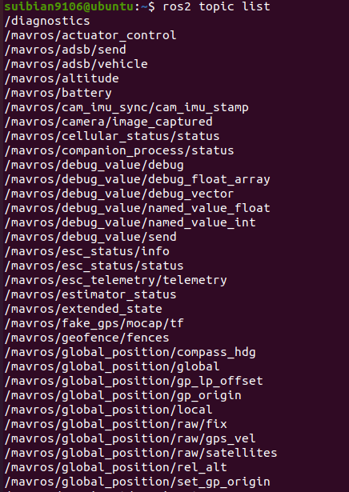
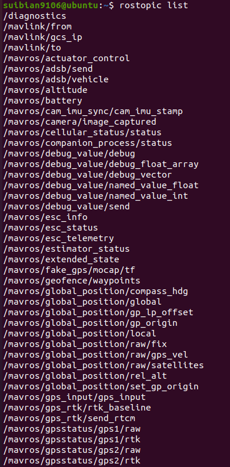
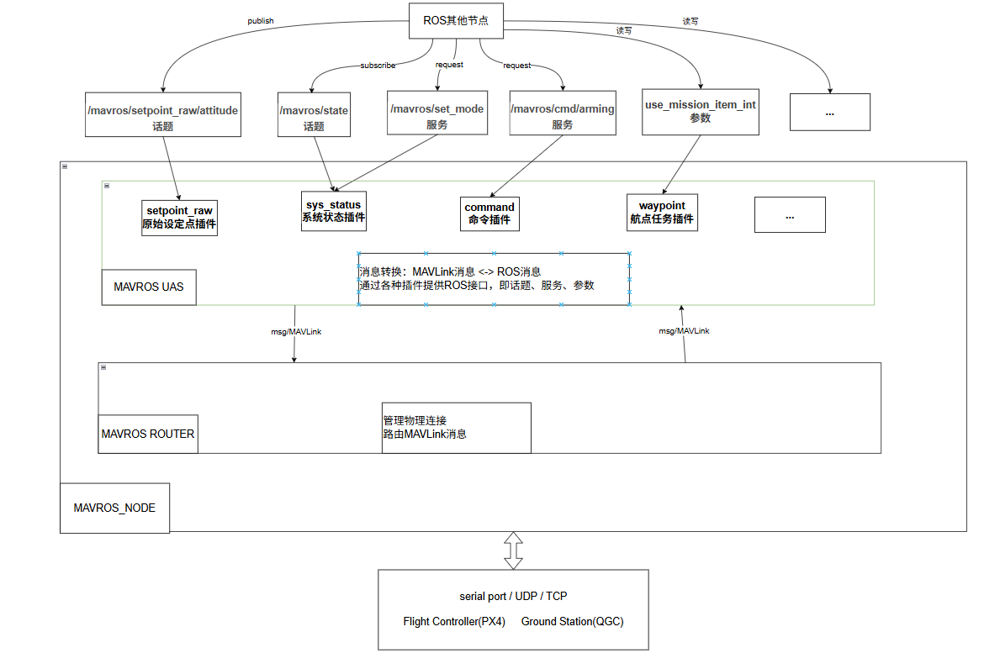

# MAVROS
ros2 mavros 启动后节点


ros1 mavros 启动后节点


ros2 mavros 部分话题


ros1 mavros 部分话题


MAVROS结构图


## MAVROS Node

它是整个MAVROS模块的启动器和协调中心。

### 详细功能分解

执行流程和其负责的具体任务如下：

1.  **初始化ROS 2环境**
    ```cpp
    rclcpp::init(argc, argv);
    ```
    这是任何ROS 2节点的标准起点，初始化。

2.  **创建多线程执行器**
    ```cpp
    rclcpp::executors::MultiThreadedExecutor exec(rclcpp::ExecutorOptions(), 2);
    ```
    创建一个可以并行运行多个节点的执行器，提高通信效率和响应速度。

3.  **创建主节点**
    ```cpp
    auto node = std::make_shared<rclcpp::Node>("mavros_node", options);
    exec.add_node(node);
    ```
    创建一个名为 `mavros_node` 的ROS 2节点，并将其加入执行器。这个节点本身不包含太多业务逻辑，更像一个“容器”或“协调员”，负责读取配置和启动其他节点。

4.  **声明和获取参数**
    ```cpp
    node->declare_parameter("fcu_url", fcu_url);
    node->get_parameter("fcu_url", fcu_url);
    // ... 其他参数
    ```
    这是ROS 2参数声明的标准方式。它从ROS参数服务器读取关键配置，例如：
    *   `fcu_url`: **最重要的参数**。指定如何连接到飞控（Flight Controller Unit）。例如：
        *   `serial:///dev/ttyACM0:921600` (通过USB串口，波特率921600)
        *   `udp://:14540@192.168.1.36:14557` (通过UDP协议)
    *   `gcs_url`: 连接到地面站的地址，用于转发MAVLink消息。
    *   `tgt_system` / `tgt_component`: 目标系统和组件ID，用于在有多架无人机时指定与哪一架通信。
    *   `*_frame_id`: 定义TF坐标系名称（如`base_link`, `odom`, `map`），用于正确发布无人机的位置和姿态信息。

5.  **启动 MAVROS Router 节点**
    ```cpp
    auto router_node = std::make_shared<mavros::router::Router>(options, "mavros_router");
    exec.add_node(router_node);
    // ... 设置router参数
    ```
    这是**通信枢纽**。它的职责是：
    *   根据 `fcu_url` 和 `gcs_url` 建立与飞控和地面站的**物理连接**（管理串口、UDP/TCP套接字）。
    *   在**MAVLink消息流**和**ROS 2 UAS节点**之间进行路由和转发。

6.  **启动 MAVROS UAS 节点**
    ```cpp
    auto uas_node = std::make_shared<mavros::uas::UAS>(options, "mavros", uas_url, tgt_system, tgt_component);
    exec.add_node(uas_node);
    // ... 设置UAS参数
    ```
    这是**业务逻辑核心**。它的职责是：
    *   **消息转换**：将来自Router的消息解码，并发布为对应的ROS 2话题（Topic）（例如：`/mavros/imu/data`, `/mavros/global_position/global`）。
    *   **服务提供**：提供ROS 2服务（Service），接收来自其他ROS节点的请求（如解锁`/mavros/cmd/arming`、设置飞行模式），并将其编码成MAVLink命令消息发送给Router。


## MAVROS Router Node

 **MAVROS Router**是 MAVROS架构中的**通信核心和消息路由枢纽**。它的主要职责是在不同的 MAVLink 通信链路（如飞控、地面站、其他 MAVROS UAS 节点）之间高效、智能地转发 MAVLink 消息。

---

### 详细功能分解

#### 1. 端点管理 (`Endpoint` 类层次结构)

Router 的核心是管理多种类型的**端点（Endpoints）**，即 MAVLink 消息的输入/输出通道。两种主要的端点：

*   **`MAVConnEndpoint`**: 处理**物理外部连接**。
    *   **功能**： 使用 `mavconn` 库建立和管理与飞控（FCU）、地面站（GCS）等外部设备的实际连接。支持多种传输方式：
        *   **串口** (`serial://`)
        *   **UDP** (`udp://`)
        *   **TCP** (`tcp://`)
    *   **行为**： 将从物理链路上收到的原始 MAVLink 字节流解码成消息，并交给 Router 进行路由。同时，将 Router 发来的 MAVLink 消息编码后通过物理链路发送出去。

*   **`ROSEndpoint`**: 处理**内部 ROS 连接**。
    *   **功能**： 在 ROS 生态系统内部提供 MAVLink 消息的**发布/订阅接口**。
    *   **行为**：
        *   **订阅** `~/mavlink_sink` 话题： 接收来自 `UAS` 节点的、包装在 `mavros_msgs/msg/Mavlink` 消息中的 MAVLink 数据，将其转换回原始的 `mavlink_message_t` 后交给 Router。
        *   **发布** `~/mavlink_source` 话题： 将来自 Router 的、经过路由决策的 `mavlink_message_t` 消息包装成 `mavros_msgs/msg/Mavlink` 并发布给`UAS` 节点。

#### 2. 智能消息路由 (`route_message` 方法)

**路由决策流程如下：**
1.  **解析目标地址**： 检查该消息类型是否包含`target_system`和`target_component`字段，并提取出它们，组合成一个目标地址 `target_addr`。
2.  **遍历端点**： 遍历所有已注册的端点（除了消息来源端点本身）。
3.  **应用路由规则**：
    *   **避免回环**： 不将消息发回给它来的那个端点 (`src->id == dest->id`)。
    *   **隔离同类链路**： 默认不直接在两个相同类型的端点（如 FCU-FCU 或 GCS-GCS）之间转发消息 (`src->link_type == dest->link_type`)，防止无人机间直接通信（这部分功能建议由专业的 `mavlink-router` 处理）。
    *   **精确匹配**： 检查目标端点是否“认识”这条消息的目标地址（即 `dest->remote_addrs` 集合中是否包含 `target_addr`）。如果认识，就发送。
4.  **广播回退**： 如果一条消息在第一次遍历中没有找到任何目标端点，Router 会将 `target_addr` 置为 0（广播地址）并**重试一次**。
5.  **统计与日志**： 记录成功转发、丢弃的消息数量，并对丢弃的消息发出警告日志。

#### 3. 远程地址发现与管理

端点（`Endpoint` ）维护了两个重要的集合：
*   `remote_addrs`： 该端点**已发现**的远程 MAVLink 系统的地址。当一个端点收到来自某个 `(sysid, compid)` 的消息时，就会把这个地址加入自己的 `remote_addrs`，表示“我知道这个系统存在”。
*   `stale_addrs`： **陈旧的**地址集合。用于实现“垃圾回收”。

**地址老化机制**（`periodic_clear_stale_remote_addrs`）：
1.  定期（例如每秒）将每个端点的 `remote_addrs` 复制到 `stale_addrs` 中。
2.  当收到来自某个地址的消息时，会从 `stale_addrs` 中移除该地址，表示“这个地址仍然是活跃的”。
3.  在下一个周期，所有仍然留在 `stale_addrs` 中的地址就会被移除出 `remote_addrs`，因为它们很久没有消息过来了。

这个机制能自动清理掉下线的设备地址，避免向无效的目标转发消息。

## MAVROS UAS Node

 **MAVROS UAS (Unmanned Aircraft System) Node**是整个 MAVROS 系统的**业务逻辑核心和 ROS 接口层**。

---

### 详细功能分解

#### 1. 初始化与设置

*   **参数获取**：从 ROS 参数服务器读取关键配置，例如：
    *   `uas_url`： 用于与 `Router` 通信的 ROS 命名空间（如 `/uas1`）。
    *   `fcu_protocol`： 指定使用的 MAVLink 协议版本（v1.0 或 v2.0）。
    *   `system_id` / `component_id`： 定义本节点在 MAVLink 网络中的源地址。
    *   `target_system_id` / `target_component_id`： 定义目标飞控的地址。
    *   `*_frame_id`： 定义 TF 坐标系名称，用于正确发布无人机的位置和姿态信息。
    *   `plugin_allowlist` 和 `plugin_denylist`： **插件黑白名单**，用于精确控制加载哪些功能插件，这对于优化系统资源和禁用不需要的功能至关重要。
*   **独立执行器**： 创建了一个独立的、多线程的执行器 (`exec`) 并在一个新线程中运行它。这使得 UAS 及其插件的回调函数可以与系统其他部分并行处理，提高了性能和响应速度。

#### 2. 插件系统 (`Plugin` System) - 核心架构

这是 UAS 节点最强大和最核心的设计。它**不是**一个巨大的、处理所有消息的单一节点，而是一个**高度模块化**的框架。

*   **插件加载器** (`plugin_factory_loader`)： 动态发现和加载所有可用的 MAVROS 插件。
*   **插件过滤** (`is_plugin_allowed`)： 根据启动参数中的 `plugin_allowlist` 和 `plugin_denylist` 来决定加载或忽略哪些插件。例如，如果你不需要操纵相机，你可以通过黑名单禁用 `camera` 插件以节省资源。
*   **消息路由表** (`plugin_subscriptions`)： 创建一个**消息 ID 到插件处理函数**的映射表。这是一个高效的分发机制：
    *   当一条 MAVLink 消息从 `Router` 传来时，UAS 节点查看它的 `msgid`。
    *   根据 `msgid` 在 `plugin_subscriptions` 表中查找所有注册要处理该消息的插件。
    *   然后调用这些插件的处理函数。
    *   例如，`HEARTBEAT` 消息 (msgid=0) 会被 `sys_status` 插件订阅和处理。

#### 3. 与 Router 的连接 (`connect_to_router`)

UAS 节点通过两个 ROS 话题与 `Router` 通信：
*   **订阅 (`source`)**： 订阅 `~/mavlink_source` 话题，接收来自 `Router` 的、已经过路由决策的 MAVLink 消息（包装在 `mavros_msgs/msg/Mavlink` 中）。收到后，将其转换回原始的 `mavlink_message_t`，然后通过 `plugin_route` 方法分发给相应的插件。
*   **发布 (`sink`)**： 向 `~/mavlink_sink` 话题发布消息。当插件或其他内部逻辑需要发送命令给飞控时，会构造一个 `mavlink_message_t`，将其包装成 `mavros_msgs/msg/Mavlink` 并通过此话题发送给 `Router`，由 `Router` 最终转发给飞控。

#### 4. 数据存储与状态管理 (`data` 成员)

UAS 类中有一个 `data` 成员，它充当了**共享数据仓库**的角色。所有插件都可以访问和修改这里的数据，例如：
*   从 `HEARTBEAT` 解析出的 `autopilot` 类型、`base_mode`、`custom_mode`。
*   从 `SYS_STATUS` 解析出的电池电压、电流、传感器状态等。
*   从 `GLOBAL_POSITION_INT` 或 `LOCAL_POSITION_NED` 解析出的经纬高、相对高度、速度等。
*   连接状态 (`connected`)。
这样避免了插件之间频繁地通过 ROS 话题互相传递数据，效率更高。

## PLUGINS

---

### 1. `command.cpp` (命令插件 - **核心插件**)

**功能**：**提供向飞控发送命令的核心服务接口**。它将ROS服务调用（如解锁、起飞、降落）转换为MAVLink的`COMMAND_LONG`或`COMMAND_INT`消息，并基于`COMMAND_ACK`实现了复杂的**命令-确认（ACK）事务机制**，确保命令可靠执行并返回结果。

**ROS 2 接口总结**：
| 类型 | 名称 | 消息/服务类型 | 方向 | 描述 |
| :--- | :--- | :--- | :--- | :--- |
| 服务 | `~/cmd/command` | `mavros_msgs/srv/CommandLong` | 服务端 | 通用长命令服务，可设置7个参数。 |
| 服务 | `~/cmd/command_int` | `mavros_msgs/srv/CommandInt` | 服务端 | 通用Int命令服务，包含经纬高字段。 |
| 服务 | `~/cmd/arming` | `mavros_msgs/srv/CommandBool` | 服务端 | **解锁/上锁**服务。 |
| 服务 | `~/cmd/takeoff` | `mavros_msgs/srv/CommandTOL` | 服务端 | **起飞**服务（全局坐标）。 |
| 服务 | `~/cmd/land` | `mavros_msgs/srv/CommandTOL` | 服务端 | **降落**服务（全局坐标）。 |
| 服务 | `~/cmd/set_home` | `mavros_msgs/srv/CommandHome` | 服务端 | **设置Home点**服务。 |
| 参数 | `command_ack_timeout` | `double` | 读写 | 等待飞控返回命令确认（ACK）的超时时间（秒）。 |
| 参数 | `use_comp_id_system_control` | `bool` | 读写 | 是否将命令发送到飞控的`COMP_ID_SYSTEM_CONTROL`组件。 |

---

### 2. `ftp.cpp` (文件传输协议插件)

**功能**：基于MAVLink消息`FILE_TRANSFER_PROTOCOL`实现了MAVLink文件传输协议（FTP），允许**通过ROS服务对飞控上的文件系统进行远程操作**，包括列出目录、读写文件、创建删除目录/文件、重命名、计算文件校验和等。

**ROS 2 接口总结**：
| 类型 | 名称 | 消息/服务类型 | 方向 | 描述 |
| :--- | :--- | :--- | :--- | :--- |
| 服务 | `~/ftp/list` | `mavros_msgs/srv/FileList` | 服务端 | 列出目录内容。 |
| 服务 | `~/ftp/open` | `mavros_msgs/srv/FileOpen` | 服务端 | 打开文件。 |
| 服务 | `~/ftp/close` | `mavros_msgs/srv/FileClose` | 服务端 | 关闭文件。 |
| 服务 | `~/ftp/read` | `mavros_msgs/srv/FileRead` | 服务端 | 读文件。 |
| 服务 | `~/ftp/write` | `mavros_msgs/srv/FileWrite` | 服务端 | 写文件。 |
| 服务 | `~/ftp/remove` | `mavros_msgs/srv/FileRemove` | 服务端 | 删除文件。 |
| 服务 | `~/ftp/mkdir` | `mavros_msgs/srv/FileMakeDir` | 服务端 | 创建目录。 |
| 服务 | `~/ftp/rmdir` | `mavros_msgs/srv/FileRemoveDir` | 服务端 | 删除目录。 |
| 服务 | `~/ftp/rename` | `mavros_msgs/srv/FileRename` | 服务端 | 重命名文件或目录。 |
| 服务 | `~/ftp/truncate` | `mavros_msgs/srv/FileTruncate` | 服务端 | 截断文件。 |
| 服务 | `~/ftp/checksum` | `mavros_msgs/srv/FileChecksum` | 服务端 | 计算文件CRC32校验和。 |
| 服务 | `~/ftp/reset` | `std_srvs/srv/Empty` | 服务端 | 重置FTP会话（调试用）。 |

---

### 3. `mission_protocol_base.cpp` (任务协议基类)

**功能**：这是一个**抽象基类**，不是独立的插件。它实现了 MAVLink 任务协议（Waypoint Protocol）的通用状态机、超时重试、消息序列处理等底层逻辑。其他具体的任务插件（如 `waypoint.cpp`, `rallypoint.cpp`）都继承自此基类。

---

### 4. `waypoint.cpp` (航点任务插件)

**功能**：实现与飞控的航点任务协议，支持航点任务的拉取、上传、清空和设置当前航点。

**主要工作**：
*   继承自 `MissionBase`，实现了完整的 MAVLink 任务协议状态机。
*   通过服务调用，触发对飞控航点任务的 `拉取(MISSION_REQUEST_LIST)`, `上传(MISSION_COUNT, MISSION_ITEM)`, `清空(MISSION_CLEAR_ALL)`, `设置当前(MISSION_SET_CURRENT)` 等操作。
*   在操作过程中发布任务列表和航点到达状态。

**ROS 2 接口总结 (对应的是/mavros/mission节点)**：
| 类型 | 名称 | 消息/服务类型 | 方向 | 描述 |
| :--- | :--- | :--- | :--- | :--- |
| 话题 | `~/mission/waypoints` | `mavros_msgs/msg/WaypointList` | 发布 | 发布当前从飞控获取的航点列表。 |
| 话题 | `~/mission/reached` | `mavros_msgs/msg/WaypointReached` | 发布 | 当飞控报告到达某个航点时发布此消息。 |
| 服务 | `~/mission/pull` | `mavros_msgs/srv/WaypointPull` | 服务端 | 提供服务，从飞控拉取当前的航点列表。 |
| 服务 | `~/mission/push` | `mavros_msgs/srv/WaypointPush` | 服务端 | 提供服务，向飞控上传新的航点列表（全部或部分）。 |
| 服务 | `~/mission/clear` | `mavros_msgs/srv/WaypointClear` | 服务端 | 提供服务，清空飞控上的航点极表。 |
| 服务 | `~/mission/set_current` | `mavros_msgs/srv/WaypointSetCurrent` | 服务端 | 提供服务，设置飞控的当前执行航点。 |
| 参数 | `pull_after_gcs` | `bool` | 读写 | 在可能被地面站（GCS）修改后是否自动重新拉取任务列表。 |
| 参数 | `use_mission_item_int` | `bool` | 读写 | 是否使用 `MISSION_ITEM_INT` 消息。 |
| 参数 | `enable_partial_push` | `int`/`bool` | 读写 | 是否启用部分航点更新（主要支持 APM）。 |

---

### 5. `imu.cpp` (IMU 插件)

**功能**：处理来自飞控的惯性测量单元 (IMU)、姿态、磁力计、温度和气压数据，并将其转换为标准的 ROS 消息格式。它支持多种 MAVLink 消息类型，并能够处理不同飞控（如 PX4 和 ArduPilot）的数据格式差异。

**主要工作**：
*   **数据转换**：将来自 `HIGHRES_IMU`, `RAW_IMU`, `SCALED_IMU`, `ATTITUDE`, `ATTITUDE_QUATERNION` 等 MAVLink 消息的数据从 FRD（前-右-下）或 NED（北-东-地）坐标系转换到 ROS 标准的 FLU（前-左-上）或 ENU（东-北-天）坐标系。
*   **状态管理**：检测并优先使用更高精度的数据源（如 `HIGHRES_IMU`）。
*   **数据发布**：将转换后的数据发布到多个 ROS 话题，供其他节点使用。

**ROS 2 接口总结**：
| 类型 | 名称 | 消息/服务类型 | 方向 | 描述 |
| :--- | :--- | :--- | :--- | :--- |
| 话题 | `~/imu/data` | `sensor_msgs/msg/Imu` | 发布 | IMU 数据，包含姿态、角速度和线性加速度，附带协方差。 |
| 话题 | `~/imu/data_raw` | `sensor_msgs/msg/Imu` | 发布 | 原始的 IMU 数据，主要包含角速度和线性加速度。 |
| 话题 | `~/imu/mag` | `sensor_msgs/msg/MagneticField` | 发布 | 磁力计数据（特斯拉，Tesla）。 |
| 话题 | `~/imu/temperature_imu` | `sensor_msgs/msg/Temperature` | 发布 | IMU 温度传感器数据。 |
| 话题 | `~/imu/temperature_baro` | `sensor_msgs/msg/Temperature` | 发布 | 气压计温度传感器数据。 |
| 话题 | `~/imu/static_pressure` | `sensor_msgs/msg/FluidPressure` | 发布 | 静态气压数据（帕斯卡，Pascal）。 |
| 话题 | `~/imu/diff_pressure` | `sensor_msgs/msg/FluidPressure` | 发布 | 差分气压数据（帕斯卡，Pascal）。 |
| 参数 | `frame_id` | `string` | 读写 | 定义发布的 ROS 消息的坐标系 ID（默认为 `base_link`）。 |
| 参数 | `linear_acceleration_stdev` | `double` | 读写 | 线性加速度的标准差，用于计算协方差矩阵。 |
| 参数 | `angular_velocity_stdev` | `double` | 读写 | 角速度的标准差，用于计算协方差矩阵。 |
| 参数 | `orientation_stdev` | `double` | 读写 | 姿态的标准差，用于计算协方差矩阵。 |
| 参数 | `magnetic_stdev` | `double` | 读写 | 磁力计数据的标准差，用于计算协方差矩阵。 |

---

### 6. `param.cpp` (参数插件)

**功能**：基于 MAVLink 消息（`PARAM_*`）实现飞控参数（Parameters）的双向同步和管理，提供了完整的参数服务。

**主要工作**：
*   **参数同步**：启动时或调用 `~/pull` 服务时，从飞控获取所有参数并缓存在本地。
*   **参数服务**：提供丰富的服务接口，允许 ROS 节点读取和设置飞控参数。
*   **事件发布**：当参数发生变化时，发布标准 ROS2 参数事件和自定义事件。

**ROS 2 接口总结**：
| 类型 | 名称 | 消息/服务类型 | 方向 | 描述 |
| :--- | :--- | :--- | :--- | :--- |
| 服务 | `~/param/pull` | `mavros_msgs/srv/ParamPull` | 服务端 | 从飞控拉取全部参数到 MAVROS 的缓存中。 |
| 服务 | `~/param/set` | `mavros_msgs/srv/ParamSetV2` | 服务端 | 设置飞控上的一个参数值。 |
| 服务 | `~/param/get_parameters` | `rcl_interfaces/srv/GetParameters` | 服务端 | **(标准 ROS2 服务)** 从缓存中获取参数值。 |
| 服务 | `~/param/get_parameter_types` | `rcl_interfaces/srv/GetParameterTypes` | 服务端 | **(标准 ROS2 服务)** 从缓存中获取参数类型。 |
| 服务 | `~/param/set_parameters` | `rcl_interfaces/srv/SetParameters` | 服务端 | **(标准 ROS2 服务)** 设置多个参数值（实际是依次调用 `~/set`）。 |
| 服务 | `~/param/set_parameters_atomically` | `rcl_interfaces/srv/SetParametersAtomically` | 服务端 | **(标准 ROS2 服务)** 原子性地设置多个参数（飞控通常不支持，直接返回失败）。 |
| 服务 | `~/param/describe_parameters` | `rcl_interfaces/srv/DescribeParameters` | 服务端 | **(标准 ROS2 服务)** 获取参数的描述符。 |
| 服务 | `~/param/list_parameters` | `rcl_interfaces/srv/ListParameters` | 服务端 | **(标准 ROS2 服务)** 列出所有已知参数名。 |
| 话题 | `~/param/event` | `mavros_msgs/msg/ParamEvent` | 发布 | 当参数值改变时发布的事件。 |

---

### 7. `setpoint_position.cpp` (位置设定点插件)

**功能**：基于 MAVLink 消息（`SET_POSITION_TARGET_LOCAL_NED` 或 `SET_POSITION_TARGET_GLOBAL_INT`）发送位置设定点指令给飞控。

**主要工作**：
*   根据订阅的话题和 `mav_frame` 参数，将位置、速度、加速度等信息从 ROS（ENU）坐标系转换到 MAVLink（NED）坐标系。

**ROS 2 接口总结**：
| 类型 | 名称 | 消息/服务类型 | 极向 | 描述 |
| :--- | :--- | :--- | :--- | :--- |
| 话题 | `~/setpoint_position/local` | `geometry_msgs/msg/PoseStamped` | 订阅 | 订阅本地（ENU）坐标系下的位置设定点。 |
| 话题 | `~/setpoint_position/global` | `geographic_msgs/msg/GeoPoseStamped` | 订阅 | 订阅全球（经纬高）坐标系下的位置设定点，直接发送 `SET_POSITION_TARGET_GLOBAL_INT`。 |
| 话题 | `~/setpoint_position/global_to_local` | `geographic_msgs/msg/GeoPoseStamped` | 订阅 | 订阅全球坐标系下的位置设定点，将其转换为本地坐标后发送 `SET_POSITION_TARGET_LOCAL_NED`。 |
| 参数 | `mav_frame` | `string` | 读写 | 指定发送位置设定点的参考坐标系（如 `LOCAL_NED`, `LOCAL_OFFSET_NED`）。 |

---

### 8. `sys_status.cpp` (系统状态插件 - **核心插件**)

**功能**：核心插件，处理飞控的心跳（`HEARTBEAT`）、系统状态（`SYS_STATUS`）、电池状态（`BATTERY_STATUS`）、扩展状态（`EXTENDED_SYS_STATE`）、事件（`EVENT`）、状态文本（`STATUSTEXT`）等 MAVLink 信息，并提供多项服务。

**主要工作**：
*   处理飞控心跳 (`HEARTBEAT`)，维护连接状态，发布 `state` 话题。
*   处理并发布各种系统状态信息 (`SYS_STATUS`, `EXTENDED_SYS_STATE`, `ESTIMATOR_STATUS`, `BATTERY_STATUS`)。
*   请求并处理飞控版本信息 (`AUTOPILOT_VERSION`)。
*   提供多项服务供用户与飞控交互（设置模式、消息速率等）。
*   发布丰富的诊断信息到 `/diagnostics` 话题。

**ROS 2 接口总结 (sys节点)**：
| 类型 | 名称 | 消息/服务类型 | 方向 | 描述 |
| :--- | :--- | :--- | :--- | :--- |
| 话题 | `~/state` | `mavros_msgs/msg/State` | 发布 | 发布飞控连接状态、解锁状态、模式等信息。 |
| 话题 | `~/extended_state` | `mavros_msgs/msg/ExtendedState` | 发布 | 发布 VTOL 状态、着陆状态等扩展状态。 |
| 话题 | `~/battery` | `sensor_msgs/msg/BatteryState` | 发布 | 发布电池状态信息（电压、电流、剩余电量等）。 |
| 话题 | `~/estimator_status` | `mavros_msgs/msg/EstimatorStatus` | 发布 | 发布估计器极态标志。 |
| 话题 | `~/statustext/recv` | `mavros_msgs/msg/StatusText` | 发布 | 发布从飞控接收到的状态文本消息。 |
| 话题 | `~/statustext/send` | `mavros_msgs/msg/statusText` | 订阅 | 订阅此话题以向飞控发送状态文本消息。 |
| 服务 | `~/set_mode` | `mavros_msgs/srv/SetMode` | 服务端 | 提供服务来设置飞控的飞行模式。 |
| 服务 | `~/set_stream_rate` | `mavros_msgs/srv/StreamRate` | 服务端 | 提供服务来设置 MAVLink 数据流速率。 |
| 服务 | `~/set_message_interval` | `mavros_msgs/srv/MessageInterval` | 服务端 | 提供服务来设置特定 MAVLink 消息的发送间隔。 |
| 服务 | `~/vehicle_info_get` | `mavros_msgs/srv/VehicleInfo` | 服务端 | 提供服务来获取已知飞行器的信息。 |
| 参数 | `conn_timeout` | `double` | 读写 | 心跳连接超时时间（秒）。 |
| 参数 | `min_voltage` | `double[]` | 读写 | 电池报警的最小电压值数组。 |
| 参数 | `disable_diag` | `bool` | 读写 | 是否禁用诊断信息发布。 |
| 参数 | `heartbeat_rate` | `double` | 读写 | 发送心跳的速率（Hz）。 |
| 参数 | `heartbeat_mav_type` | `string` | 读写 | 发送心跳时使用的 MAV_TYPE。 |