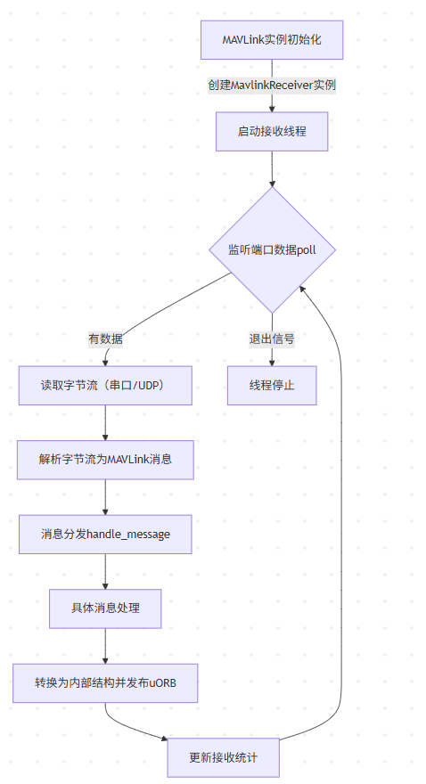
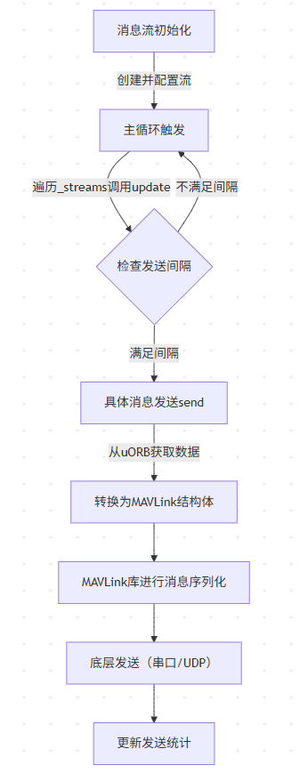

# PX4 MAVLink通信消息接收与发送流程

## 一、MAVLink消息接收流程

MAVLink消息接收流程负责从串口或UDP端口读取数据，解析为MAVLink消息并转换为PX4内部数据结构，最终通过uORB发布供其他模块使用。



### 1. 模块初始化与准备

**核心目标**：初始化`Mavlink`及`MavlinkReceiver`实例，配置系统ID、组件ID，创建必要的uORB话题。

- **`Mavlink`类初始化**：在构造函数中创建`MavlinkReceiver`实例，设置系统/组件ID，并确保关键uORB话题（如`vehicle_command`）存在。

  ```cpp
  // mavlink_main.cpp：Mavlink类构造函数
  Mavlink::Mavlink() :
      ModuleParams(nullptr),
      _receiver(*this)  // 初始化MavlinkReceiver实例
  {
      // 初始化参数缓存
      mavlink_update_parameters();

      // 设置系统ID和组件ID
      int sys_id = _param_mav_sys_id.get();
      if (sys_id > 0 && sys_id < 255) {
          mavlink_system.sysid = sys_id;  // 系统ID（如无人机编号）
      }

      int comp_id = _param_mav_comp_id.get();
      if (comp_id > 0 && comp_id < 255) {
          mavlink_system.compid = comp_id;  // 组件ID（如飞控组件）
      }

      // 确保vehicle_command话题存在，避免丢失首个命令
      if (orb_exists(ORB_ID(vehicle_command), 0) == PX4_ERROR) {
          orb_advertise(ORB_ID(vehicle_command), nullptr);
      }
  }
  ```


### 2. 接收线程启动

**核心目标**：启动独立线程监听通信端口（串口/UDP），持续接收数据。

- **线程创建**：`MavlinkReceiver::start()`创建线程，指定入口函数为`run()`，并设置线程优先级和栈大小。

  ```cpp
  // mavlink_receiver.cpp：启动接收线程
  void MavlinkReceiver::start()
  {
      pthread_attr_t receiveloop_attr;
      pthread_attr_init(&receiveloop_attr);

      struct sched_param param;
      param.sched_priority = SCHED_PRIORITY_MAX - 80;  // 设置线程优先级
      (void)pthread_attr_setschedparam(&receiveloop_attr, &param);

      // 创建线程，通过跳板函数调用run()
      pthread_create(&_thread, &receiveloop_attr, MavlinkReceiver::start_trampoline, (void *)this);
      pthread_attr_destroy(&receiveloop_attr);
  }

  // 线程入口跳板函数
  void *MavlinkReceiver::start_trampoline(void *context)
  {
      MavlinkReceiver *self = reinterpret_cast<MavlinkReceiver *>(context);
      self->run();  // 进入接收主循环
      return nullptr;
  }
  ```


### 3. 接收主循环：监听与读取数据

**核心目标**：通过`poll`监听端口数据，读取字节流并暂存到缓冲区。

- **`run()`函数**：接收线程的主循环，负责监听端口、读取数据、触发解析。

  ```cpp
  // mavlink_receiver.cpp：接收主循环
  void MavlinkReceiver::run()
  {
      // 设置线程名称（便于调试）
      char thread_name[17];
      snprintf(thread_name, sizeof(thread_name), "mavlink_rcv_if%d", _mavlink.get_instance_id());
      px4_prctl(PR_SET_NAME, thread_name, px4_getpid());

      // 初始化poll结构（监听串口/UDP文件描述符）
      struct pollfd fds[1] = {};
      if (_mavlink.get_protocol() == Protocol::SERIAL) {
          fds[0].fd = _mavlink.get_uart_fd();  // 串口文件描述符
          fds[0].events = POLLIN;  // 监听输入事件
      }
  #ifdef MAVLINK_UDP
      else if (_mavlink.get_protocol() == Protocol::UDP) {
          fds[0].fd = _mavlink.get_socket_fd();  // UDP socket描述符
          fds[0].events = POLLIN;
      }
  #endif

      uint8_t buf[1600 * 5];  // 数据缓冲区（适配UDP最大包长）
      mavlink_message_t msg;
      ssize_t nread = 0;

      // 持续监听直到退出信号
      while (!_mavlink.should_exit()) {
          // 检查参数更新（如系统ID修改）
          if (_parameter_update_sub.updated()) {
              parameter_update_s pupdate;
              _parameter_update_sub.copy(&pupdate);
              updateParams();  // 更新参数
          }

          // 等待数据（超时10ms，避免阻塞）
          int ret = poll(&fds[0], 1, 10);

          if (ret > 0) {  // 有数据可读
              if (_mavlink.get_protocol() == Protocol::SERIAL) {
                  // 从串口读取数据
                  nread = ::read(fds[0].fd, buf, sizeof(buf));
              }
  #ifdef MAVLINK_UDP
              else if (_mavlink.get_protocol() == Protocol::UDP) {
                  // 从UDP读取数据（含源地址）
                  struct sockaddr_in srcaddr;
                  socklen_t addrlen = sizeof(srcaddr);
                  nread = recvfrom(_mavlink.get_socket_fd(), buf, sizeof(buf), 0, (struct sockaddr *)&srcaddr, &addrlen);
              }
  #endif

              // 解析字节流为MAVLink消息
              for (ssize_t i = 0; i < nread; i++) {
                  if (mavlink_parse_char(_mavlink.get_channel(), buf[i], &msg, &_status)) {
                      // 根据模式分发消息（默认模式调用handle_message）
                      switch (_mavlink.get_mode()) {
                      case Mavlink::MAVLINK_MODE::MAVLINK_MODE_GIMBAL:
                          handle_messages_in_gimbal_mode(msg);
                          break;
                      default:
                          handle_message(&msg);  // 核心消息处理入口
                          break;
                      }

                      // 更新接收状态统计
                      _mavlink.set_has_received_messages(true);
                      update_rx_stats(msg);
                  }
              }
          }
      }
  }
  ```


### 4. 消息解析与分发

**核心目标**：将解析出的`mavlink_message_t`按消息ID（`msgid`）分发到对应的处理函数。

- **`handle_message`函数**：根据消息ID路由到具体处理函数（如光流、Ping、手动控制等）。

  ```cpp
  // mavlink_receiver.cpp：消息分发
  void MavlinkReceiver::handle_message(mavlink_message_t *msg)
  {
      switch (msg->msgid) {
      case MAVLINK_MSG_ID_OPTICAL_FLOW_RAD:
          handle_message_optical_flow_rad(msg);  // 光流消息处理
          break;
      case MAVLINK_MSG_ID_PING:
          handle_message_ping(msg);  // Ping消息处理
          break;
      case MAVLINK_MSG_ID_MANUAL_CONTROL:
          handle_message_manual_control(msg);  // 手动控制消息处理
          break;
      // ... 其他消息ID的分发（省略）
      default:
          break;
      }

      // 其他模块的附加处理（任务、参数、FTP等）
      _mission_manager.handle_message(msg);
      if (_mavlink.boot_complete()) {
          _parameters_manager.handle_message(msg);
      }
      if (_mavlink.ftp_enabled()) {
          _mavlink_ftp.handle_message(msg);
      }
  }
  ```


### 5. 具体消息处理与uORB发布

**核心目标**：解码MAVLink消息，转换为PX4内部数据结构，并通过uORB发布供其他模块订阅。

- **示例：光流消息处理**：`handle_message_optical_flow_rad`将MAVLink光流消息转换为`sensor_optical_flow_s`并发布。

  ```cpp
  // mavlink_receiver.cpp：光流消息处理
  void MavlinkReceiver::handle_message_optical_flow_rad(mavlink_message_t *msg)
  {
      mavlink_optical_flow_rad_t flow;
      mavlink_msg_optical_flow_rad_decode(msg, &flow);  // 解码MAVLink消息

      // 初始化设备ID（标识消息来源）
      device::Device::DeviceId device_id;
      device_id.devid_s.bus_type = device::Device::DeviceBusType::DeviceBusType_MAVLINK;
      device_id.devid_s.bus = _mavlink.get_instance_id();
      device_id.devid_s.address = msg->sysid;
      device_id.devid_s.devtype = DRV_FLOW_DEVTYPE_MAVLINK;

      // 转换为PX4内部的sensor_optical_flow_s结构
      sensor_optical_flow_s sensor_optical_flow{};
      sensor_optical_flow.timestamp_sample = hrt_absolute_time();
      sensor_optical_flow.device_id = device_id.devid;
      sensor_optical_flow.pixel_flow[0] = flow.integrated_x;  // 像素流X分量
      sensor_optical_flow.pixel_flow[1] = flow.integrated_y;  // 像素流Y分量
      sensor_optical_flow.integration_timespan_us = flow.integration_time_us;
      sensor_optical_flow.quality = flow.quality;  // 光流质量

      // 发布到uORB话题（供导航模块使用）
      sensor_optical_flow.timestamp = hrt_absolute_time();
      _sensor_optical_flow_pub.publish(sensor_optical_flow);
  }
  ```


### 6. 接收状态统计

**核心目标**：记录接收消息数、丢包数等统计信息，用于监控通信质量。

- **`update_rx_stats`函数**：更新每个组件（系统ID+组件ID）的接收统计，包括丢包计算（考虑序列号溢出）。

  ```cpp
  // mavlink_receiver.cpp：更新接收统计
  void MavlinkReceiver::update_rx_stats(const mavlink_message_t &message)
  {
      for (unsigned i = 0; i < MAX_REMOTE_COMPONENTS; ++i) {
          if (_component_states[i].system_id == message.sysid && _component_states[i].component_id == message.compid) {
              // 计算丢包数（处理序列号0-255溢出）
              const uint8_t expected_seq = _component_states[i].last_sequence + 1;
              int lost_messages = (message.seq < expected_seq) ? 
                  (message.seq + 255) - expected_seq : message.seq - expected_seq;

              _component_states[i].missed_messages += lost_messages;
              _component_states[i].received_messages++;
              _component_states[i].last_sequence = message.seq;

              // 更新全局统计
              _total_received_counter++;
              _total_lost_counter += lost_messages;
              return;
          }
      }
  }
  ```


## 二、MAVLink消息发送流程

MAVLink消息发送流程负责将PX4内部状态（如姿态、位置）转换为MAVLink消息，按配置的频率发送到外部设备。




### 1. 消息流初始化与配置

**核心目标**：创建并配置消息流（如心跳、姿态、位置），指定发送频率。

- **消息流管理**：通过`StreamListItem`管理支持的消息类型，`create_mavlink_stream`根据消息名或ID创建实例。

  ```cpp
  // mavlink_messages.cpp：创建消息流实例
  MavlinkStream *create_mavlink_stream(const char *stream_name, Mavlink *mavlink)
  {
      for (const auto &stream : streams_list) {  // streams_list存储所有支持的消息流
          if (strcmp(stream_name, stream.get_name()) == 0) {
              return stream.new_instance(mavlink);  // 创建对应消息流实例
          }
      }
      return nullptr;
  }

  // mavlink_main.cpp：配置消息流（如设置发送频率）
  Mavlink::configure_stream(const char *stream_name, const float rate)
  {
      MavlinkStream *stream = create_mavlink_stream(stream_name, this);
      if (stream != nullptr) {
          stream->set_interval(1e6 / rate);  // 计算发送间隔（微秒）
          _streams.add(stream);  // 添加到流列表
          return OK;
      }
      return -1;
  }
  ```


### 2. 发送触发（主循环更新）

**核心目标**：定期检查消息流的发送间隔，触发消息发送。

- **`Mavlink`主循环**：遍历所有消息流，调用`update`方法检查是否需要发送。

  ```cpp
  // mavlink_main.cpp：主循环触发发送
  void Mavlink::task_main()
  {
      while (!should_exit()) {
          hrt_abstime t = hrt_absolute_time();

          // 遍历所有消息流，触发更新
          for (const auto &stream : _streams) {
              stream->update(t);  // 检查是否满足发送条件
          }

          // ... 其他逻辑（如处理接收反馈）
      }
  }

  // MavlinkStream::update：检查发送间隔
  int MavlinkStream::update(const hrt_abstime &t)
  {
      if (t - _last_sent >= _interval) {  // 若当前时间超过上次发送时间+间隔
          _last_sent = t;
          return send();  // 发送消息
      }
      return 0;
  }
  ```


### 3. 具体消息发送实现

**核心目标**：从uORB订阅内部状态，转换为MAVLink消息结构体。

- **示例：姿态消息发送**：`MavlinkStreamAttitude`从uORB订阅`vehicle_attitude`，转换为MAVLink消息。

  ```cpp
  // 伪代码：姿态消息发送实现
  bool MavlinkStreamAttitude::send()
  {
      vehicle_attitude_s att;
      if (_att_sub.update(&att)) {  // 从uORB获取最新姿态
          mavlink_attitude_t msg{};
          msg.time_boot_ms = att.timestamp / 1000;  // 转换时间戳
          msg.roll = att.roll;  // 横滚角
          msg.pitch = att.pitch;  // 俯仰角
          msg.yaw = att.yaw;  // 偏航角
          // ... 填充其他字段

          // 调用MAVLink库发送函数
          mavlink_msg_attitude_send_struct(_mavlink->get_channel(), &msg);
          return true;
      }
      return false;
  }
  ```


### 4. MAVLink库消息序列化

**核心目标**：将消息结构体序列化为MAVLink帧（含头部、校验和）。

- **`_mav_finalize_message_chan_send`**：MAVLink库核心函数，构建完整帧并调用底层发送。

  ```cpp
  // MAVLink库：序列化消息帧
  void _mav_finalize_message_chan_send(mavlink_channel_t chan, uint8_t msgid, const char *packet, 
                                      uint8_t length, uint8_t crc_extra)
  {
      uint16_t checksum;
      uint8_t buf[MAVLINK_NUM_HEADER_BYTES];  // 消息头缓冲区
      uint8_t ck[2];  // 校验和缓冲区

      // 构建消息头（起始符、长度、序列号、系统ID、组件ID、消息ID）
      buf[0] = MAVLINK_STX;  // 起始符（0xFE）
      buf[1] = length;       // payload长度
      buf[2] = status->current_tx_seq++;  // 序列号（自增）
      buf[3] = mavlink_system.sysid;     // 系统ID
      buf[4] = mavlink_system.compid;    // 组件ID
      buf[5] = msgid;        // 消息ID

      // 计算校验和
      checksum = crc_calculate((const uint8_t*)&buf[1], MAVLINK_CORE_HEADER_LEN);
      crc_accumulate_buffer(&checksum, packet, length);
      crc_accumulate(crc_extra, &checksum);  // 附加校验（可选）
      ck[0] = (uint8_t)(checksum & 0xFF);
      ck[1] = (uint8_t)(checksum >> 8);

      // 发送帧（头 + payload + 校验和）
      _mavlink_send_uart(chan, (const char *)buf, MAVLINK_NUM_HEADER_BYTES);
      _mavlink_send_uart(chan, packet, length);
      _mavlink_send_uart(chan, (const char *)ck, 2);
  }
  ```


### 5. 底层发送（串口/UDP）

**核心目标**：通过串口或UDP将MAVLink帧发送到外部设备。

- **`send_bytes`与`send_finish`**：将帧数据写入硬件接口。

  ```cpp
  // mavlink_main.cpp：底层发送实现
  void Mavlink::send_bytes(const uint8_t *buf, unsigned packet_len)
  {
      if (!_tx_buffer_low) {  // 缓冲区有空间
          memcpy(&_buf[_buf_fill], buf, packet_len);  // 复制到发送缓冲区
          _buf_fill += packet_len;
      }
  }

  void Mavlink::send_finish()
  {
      if (_tx_buffer_low || (_buf_fill == 0)) {
          pthread_mutex_unlock(&_send_mutex);
          return;
      }

      // 串口发送
      if (get_protocol() == Protocol::SERIAL) {
          ret = ::write(_uart_fd, _buf, _buf_fill);  // 写入串口
      }
  #ifdef MAVLINK_UDP
      // UDP发送
      else if (get_protocol() == Protocol::UDP) {
          ret = sendto(_socket_fd, _buf, _buf_fill, 0, (struct sockaddr *)&_src_addr, sizeof(_src_addr));
      }
  #endif

      if (ret == (int)_buf_fill) {
          _tstatus.tx_message_count++;  // 发送成功计数
      } else {
          count_txerrbytes(_buf_fill);  // 发送失败计数
      }

      _buf_fill = 0;  // 清空缓冲区
      pthread_mutex_unlock(&_send_mutex);
  }
  ```