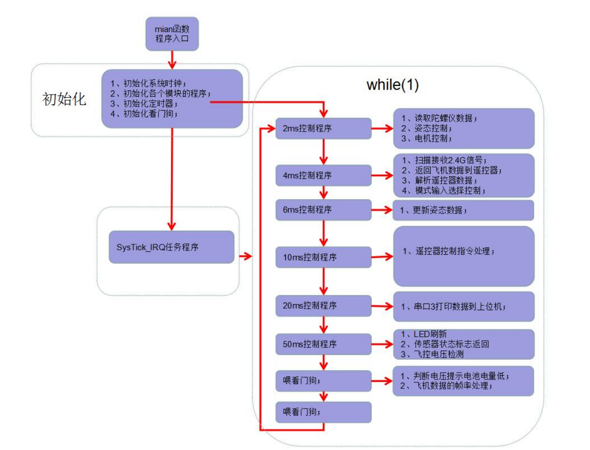
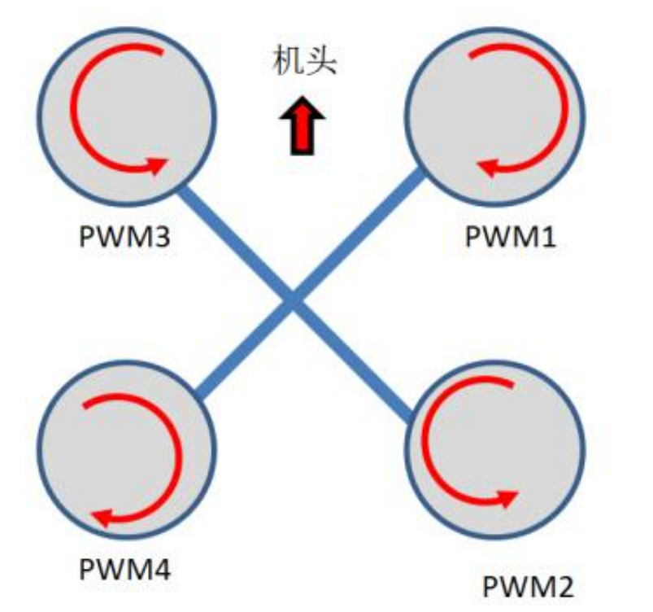

## 飞控程序流程图


##  代码具体解读
### 1.主程序
```c
int main(void)
{	
	cycleCounterInit();  //得到系统每个us的系统CLK个数，为以后延时函数，和得到精准的当前执行时间使用
	NVIC_PriorityGroupConfig(NVIC_PriorityGroup_4); //4个bit的抢占优先级，4个bit的子优先级
	SysTick_Config(SystemCoreClock / 1000);	//系统滴答时钟

	ALL_Init();//系统初始化 
  IWDG_Init(4,625);    //初始化看门狗  与分频为64,重载值为625,溢出时间1s
	
	while(1)
	{
		  main_loop();  //程序运行
				
		  IWDG_Feed();  //喂看门狗防止程序跑死
	}
}
```

主程序进行初始化和循环调用`main_loop()`函数，`main_loop()`函数执行各种周期任务，pid控制任务为2ms的周期

```c
void main_loop()
{
	if( loop.check_flag >= 1 )
	{
		
		if( loop.cnt_2ms >= 1 )
		{
			loop.cnt_2ms = 0;
			
			Duty_2ms();	 					//周期2ms的任务
		}
		if( loop.cnt_4ms >= 2 )
		{
			loop.cnt_4ms = 0;
			Duty_4ms();						//周期4ms的任务
		}
		···
        ···
	}
}
void Duty_2ms()
{
	time[0] = GetSysTime_us();
	
	MpuGetData();				          //读取陀螺仪和加速度计数据，陀螺仪输出为三轴角速度，加速度计输出三轴加速度
	FlightPidControl(0.002f);     /// 姿态控制，进行PID控制
	MotorControl();               //电机控制，使用PID控制输出来控制电机PWM值
	
	time[0] = GetSysTime_us() - time[0];
}
```
### 2.获取MPU数据
```c
static volatile int16_t *pMpu = (int16_t *)&MPU6050;
#define  Gyro_Read() IIC_read_Bytes(MPU6050_ADDRESS, 0X3B,buffer,6)
#define  Acc_Read() IIC_read_Bytes(MPU6050_ADDRESS, 0x43,&buffer[6],6)
void MpuGetData(void) //读取陀螺仪数据加滤波
{
	uint8_t i;
    uint8_t buffer[12];

	Gyro_Read();
	Acc_Read();

		for(i=0;i<6;i++)
		{
			pMpu[i] = (((int16_t)buffer[i<<1] << 8) | buffer[(i<<1)+1])-MpuOffset[i];		
			if(i < 3)
			{
				// 对陀螺仪（前3个数据）使用卡尔曼滤波
				{
					static struct _1_ekf_filter ekf[3] = {{0.02,0,0,0,0.001,0.543},{0.02,0,0,0,0.001,0.543},{0.02,0,0,0,0.001,0.543}};	
					kalman_1(&ekf[i],(float)pMpu[i]);  //一维卡尔曼
					pMpu[i] = (int16_t)ekf[i].out;
				}
			}
			if(i > 2)
			{	
				// 对加速度计（后3个数据）使用低通滤波
				uint8_t k=i-3;
				const float factor = 0.15f;  //滤波因素			
				static float tBuff[3];		

				pMpu[i] = tBuff[k] = tBuff[k] * (1 - factor) + pMpu[i] * factor;                
			}
		}
}
```
读取陀螺仪和加速度计数据，并进行滤波为后续的姿态解算和控制提供更可靠的数据基础
### 3.PID控制
```c
void FlightPidControl(float dt)
{
	volatile static uint8_t status=WAITING_1;
	switch(status)
	{		
		case WAITING_1: //等待解锁
			if(ALL_flag.unlock)
			{
				status = READY_11;	
			}			
			break;
		case READY_11:  //准备进入控制
			pidRest(pPidObject,8); //批量复位PID数据，防止上次遗留的数据影响本次控制

			Angle.yaw = pidYaw.desired =  pidYaw.measured = 0;   //俯仰和横滚有物理参考（重力方向），偏航无，取解锁时方向为初始方向
		
			status = PROCESS_31;
			break;			
		case PROCESS_31: //正式进入控制
			
            pidRateX.measured = MPU6050.gyroX * Gyro_G; //将原始角速度数据转换为角度/秒，内环测量值，Gyro_G是一个常量
			pidRateY.measured = MPU6050.gyroY * Gyro_G; //内环测量值 角度/秒
			pidRateZ.measured = MPU6050.gyroZ * Gyro_G; //内环测量值 角度/秒
		
			pidPitch.measured = Angle.pitch; 		//外环测量值 单位：角度，由陀螺仪和加速度计数据通过四元数解算出的欧拉角
		    pidRoll.measured = Angle.roll;			//外环测量值 单位：角度
			pidYaw.measured = Angle.yaw;			//外环测量值 单位：角度
		
		 	pidUpdate(&pidRoll,dt);    //调用PID处理函数来处理外环	横滚角PID，角度的期望值由遥控器进行控制
			pidRateX.desired = pidRoll.out; //将外环的PID输出作为内环PID的期望值即为串级PID
			pidUpdate(&pidRateX,dt);  //再调用内环

		 	pidUpdate(&pidPitch,dt);    //调用PID处理函数来处理外环	俯仰角PID，角度的期望值由遥控器进行控制
			pidRateY.desired = pidPitch.out;  
			pidUpdate(&pidRateY,dt); //再调用内环

			CascadePID(&pidRateZ,&pidYaw,dt);	//也可以直接调用串级PID函数来处理，其实就是上述一样的两个pidUpdate函数调用
			break;
	}
}
//获取遥控器控制的三个角度的期望值
void RC_Analy(void)  
{
	static uint16_t cnt,cnt_tmp;
	//控制数据优先级
	if(Nrf_Erro==1 || WIFI_UFO_Err==1) // 有遥控信号
	{ 	
		{
			const float roll_pitch_ratio = 0.04f;	
			const float yaw_ratio =  0.0015f;    

			//摇杆从1500到2000：角度变化 = 500 × 0.04 = 20°,最大倾斜角20°
			pidPitch.desired = -(Remote.pitch-1500)*roll_pitch_ratio;
			pidRoll.desired  = -(Remote.roll-1500) *roll_pitch_ratio;  
			
			// 偏航使用速率控制而非直接指定角度,控制更精细，阈值机制（1820和1180），死区范围：1180-1820（±320μs）
			if(Remote.yaw>1820)
				{
					pidYaw.desired -= 0.75f;
				}
				else if(Remote.yaw <1180)
				{
					pidYaw.desired += 0.75f;	
				}				
		}
		remote_unlock(); // 解锁判断
			
  }		
//如果3秒没收到遥控数据，则判断遥控信号丢失，飞控在任何时候停止飞行，避免伤人。
//意外情况，使用者可紧急关闭遥控电源，飞行器会在3秒后立即关闭，避免伤人。
//立即关闭遥控，如果在飞行中会直接掉落，可能会损坏飞行器。
  else
	{					
		cnt++;
		if(cnt>800)						//3秒没有遥控器信号 判断遥控器失联 信号断线 自动下降保护
		{	
			···
		}
	}	
}

void pidUpdate(PidObject* pid,const float dt)
{
	 float error;
	 float deriv;
	
    error = pid->desired - pid->measured; //当前角度与实际角度的误差

    pid->integ += error * dt;	 //误差积分累加值

    deriv = (error - pid->prevError)/dt;  //前后两次误差做微分
	
    pid->out = pid->kp * error + pid->ki * pid->integ + pid->kd * deriv;//PID输出
		
    pid->prevError = error;  //更新上次的误差	
}
typedef volatile struct
{
	float desired;     ///期望
	float offset;      //
	float prevError;    // 上次偏差
	float integ;        //误差积分累加值
	float kp;           //p参数
	float ki;           //i参数
	float kd;           //d参数
	float IntegLimitHigh;       //< integral limit
	float IntegLimitLow;
	float measured;     ////pid反馈量
	float out;
	float OutLimitHigh;
	float OutLimitLow;	
	float Control_OutPut;//控制器总输出
	float Last_Control_OutPut;//上次控制器总输出
	float Control_OutPut_Limit;//输出限幅
		/***************************************/
	float Last_FeedBack;//上次反馈值
	float Dis_Err;//微分量
	float Dis_Error_History[5];//历史微分量
	float Err_LPF;
	float Last_Err_LPF;
	float Dis_Err_LPF;

//	int8_t Err_Limit_Flag :1;//偏差限幅标志
//	int8_t Integrate_Limit_Flag :1;//积分限幅标志
//	int8_t Integrate_Separation_Flag :1;//积分分离标志		
  Butter_BufferData Control_Device_LPF_Buffer;//控制器低通输入输出缓冲	
}PidObject;
```
使用串级PID，**外环**（角度，由期望角度得到期望角速度）+**内环**（角速度，由期望角速度得到期望电机PWM值），外环保证大方向的稳定，内环快速地响应，提高无人机对角度变化的敏感度。飞机机身开始转动（产生了角速度），但单级PID（外环角度）要等到这个转动累积成明显的角度误差后才会开始纠正，此时干扰已经造成了较大影响。

### 4.电机控制
```c
void MotorControl(void) //电机控制
{	
	volatile static uint8_t status=WAITING_1;
	if(ALL_flag.unlock == EMERGENT) //意外情况，请使用遥控紧急上锁，飞控就可以在任何情况下紧急中止飞行，锁定飞行器，退出PID控制
		status = EXIT_255;	
	switch(status)
	{		
		case WAITING_1: 	     //等待解锁	
			MOTOR1 = MOTOR2 = MOTOR3 = MOTOR4 = 0;  //如果锁定，则电机输出都为0
			if(ALL_flag.unlock)
			{
				status = WAITING_2;
			}
		case WAITING_2: //解锁完成后判断使用者是否开始拨动遥杆进行飞行控制
			if(Remote.thr>1100)
			{
				status = PROCESS_31;
			}
			break;
		case PROCESS_31:
			{
				int16_t thr_temp;

					thr_temp = Remote.thr -1000; //输出给电机的是油门输出值，遥控器通道的原始值范围通常是1000~2000μs,归一化初始值为0
				
				if(Remote.thr<1020)		//油门太低了，这时姿态控制占主导了，则限制输出，不然飞机乱转，
				{
					MOTOR1 = MOTOR2 = MOTOR3 = MOTOR4=0;
					break;
				}
				MOTOR1 = MOTOR2 = MOTOR3 = MOTOR4 = LIMIT(thr_temp,0,900); //留100给姿态控制

				MOTOR1 +=    + pidRateX.out - pidRateY.out - pidRateZ.out;//; 姿态输出分配给各个电机的控制量
				MOTOR2 +=    + pidRateX.out + pidRateY.out + pidRateZ.out;
				MOTOR3 +=    - pidRateX.out + pidRateY.out - pidRateZ.out;
				MOTOR4 +=    - pidRateX.out - pidRateY.out + pidRateZ.out;
			}	
			break;
		case EXIT_255:
			MOTOR1 = MOTOR2 = MOTOR3 = MOTOR4 = 0;  //如果锁定，则电机输出都为0
			status = WAITING_1;	
			break;
		default:
			break;
	}
	
	#if (FLY_TYPE == 1 || FLY_TYPE == 2)
	
	PWM0 = LIMIT(MOTOR1,0,1000);  //更新PWM1
	PWM1 = LIMIT(MOTOR2,0,1000);  //更新PWM2
	PWM2 = LIMIT(MOTOR3,0,1000);  //更新PWM3
	PWM3 = LIMIT(MOTOR4,0,1000);  //更新PWM4
	
#elif (FLY_TYPE >= 3)
	
	PWM0 = 1000 + LIMIT(MOTOR1,0,1000);  //更新PWM1
	PWM1 = 1000 + LIMIT(MOTOR2,0,1000);  //更新PWM2
	PWM2 = 1000 + LIMIT(MOTOR3,0,1000);  //更新PWM3     
	PWM3 = 1000 + LIMIT(MOTOR4,0,1000);  //更新PWM4
	
#else
	#error Please define FLY_TYPE!
		
#endif
} 
```

姿态输出分配给各个电机的控制量时采用**混控矩阵**。四旋翼为4 x 4；六旋翼为6 x 4
[ M1 ]   [ 1  +1  +1  +1 ]   [ T ]
[ M2 ] = [ 1  +1  -1  -1 ] × [ Roll\X ]
[ M3 ]   [ 1  -1  +1  -1 ]   [ Pitch\Y ]
[ M4 ]   [ 1  -1  -1  +1 ]   [ Yaw\Z ]

**垂直力平衡**：所有电机推力之和 = 重力 + 加速度需求
**横滚力矩平衡**：左右电机推力差产生横滚力矩
**俯仰力矩平衡**：前后电机推力差产生俯仰力矩
**偏航力矩平衡**：对角线电机反转力矩差产生偏航力矩

**力矩**是描述一个力对某点或某轴产生的旋转效果的物理量。它的大小等于力与力臂（即力的作用线到旋转点的垂直距离）的乘积，方向垂直于力和力臂所在的平面，遵循右手螺旋定则确定。`力矩`是使物体产生`角加速度`的原因。