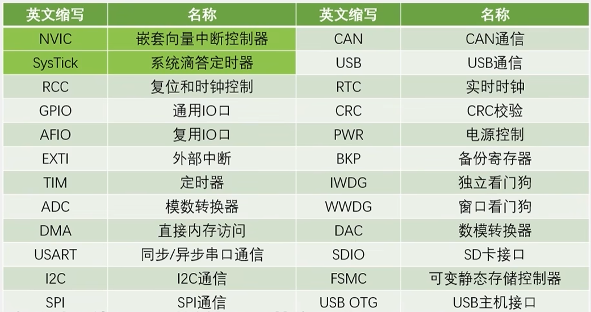
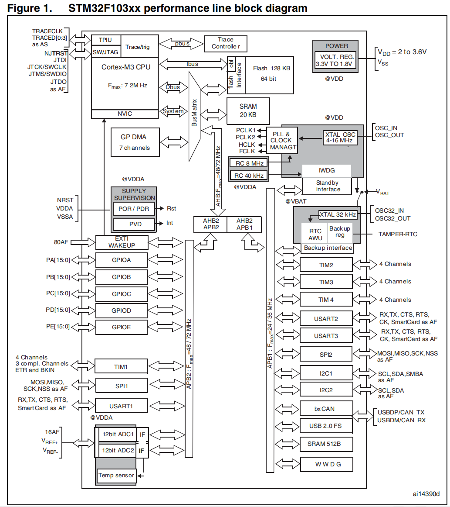
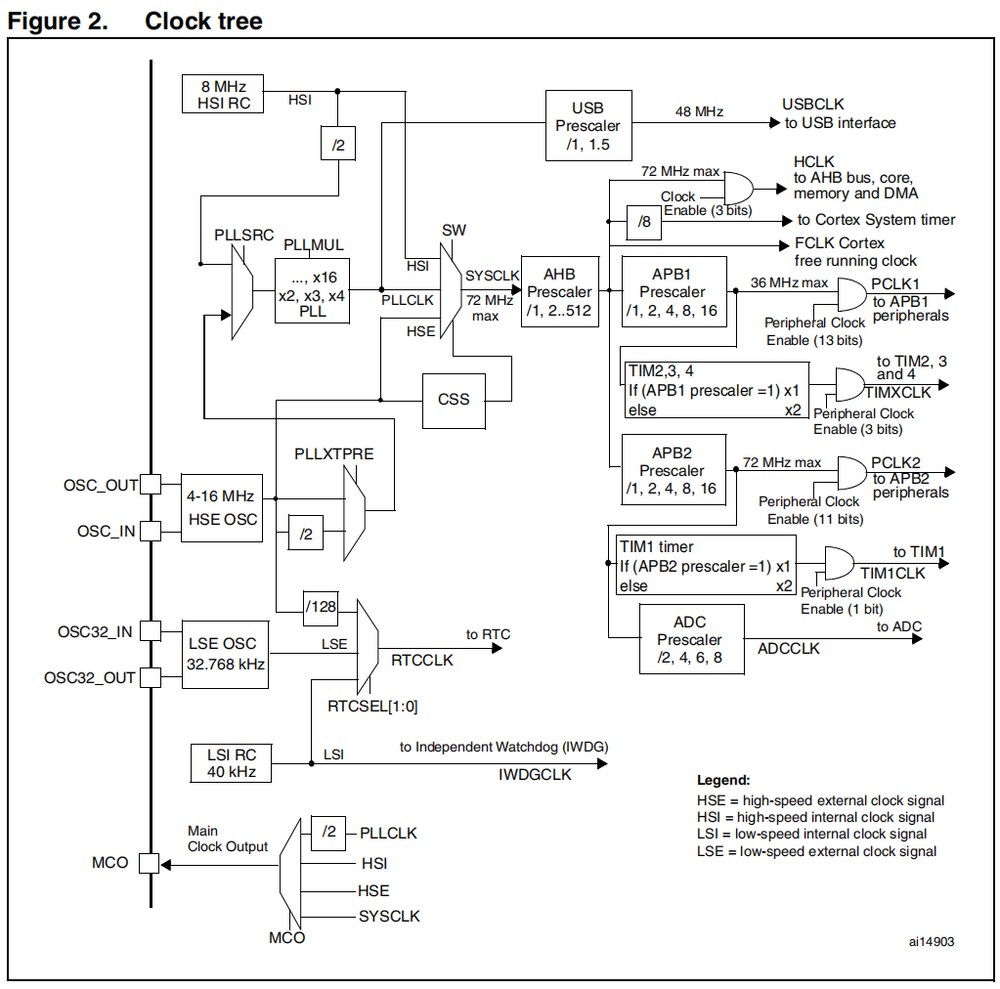
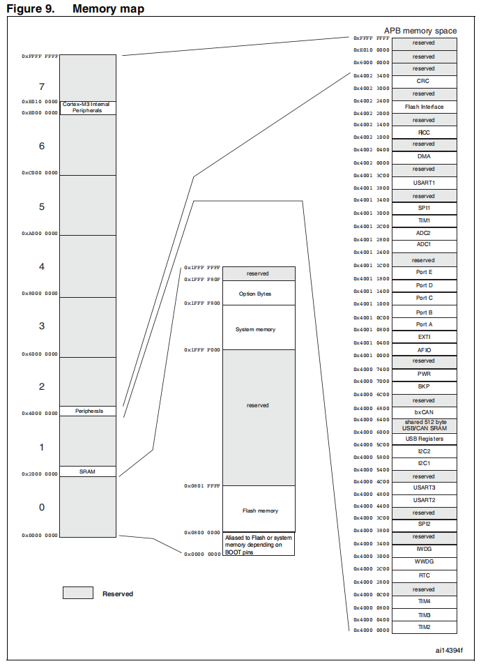
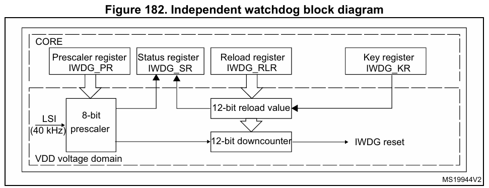
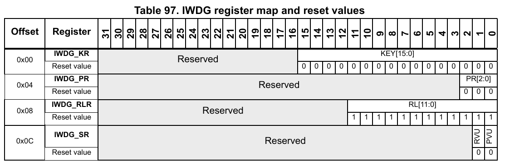
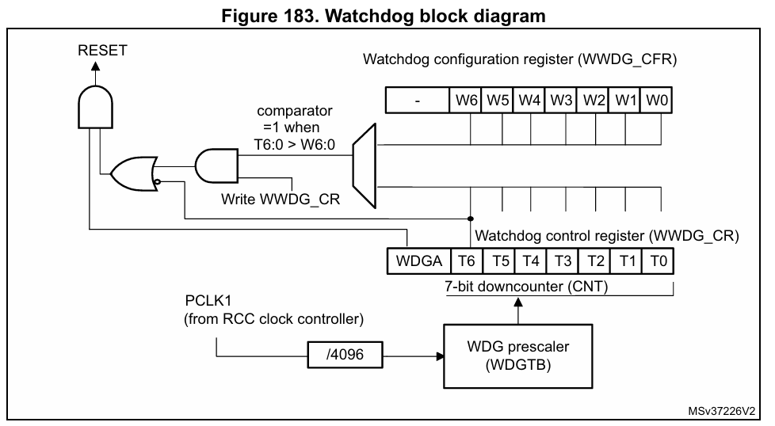
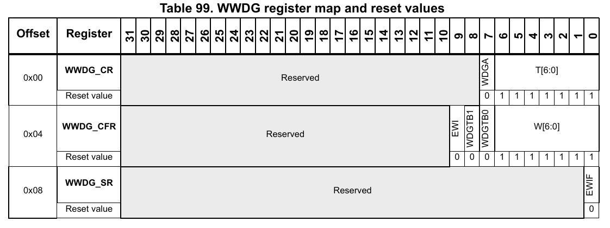
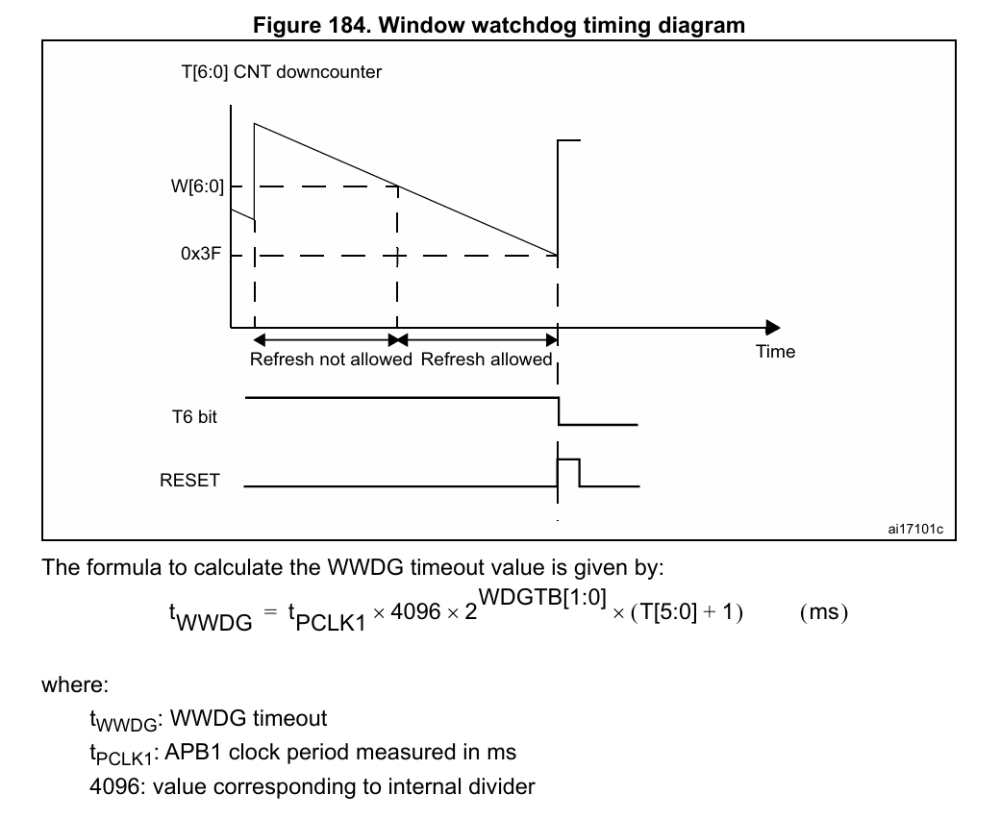

## 基础
主控芯片：STM32F103C8T6
* 系列：主流系列STM32F1
* 内核：ARM Cortex-M3
* 主频：72MHZ
* RAM：20K(SRAM)
* ROM：64K(FLASH)

| 部分 | 含义 | 具体说明 |
|------|------|----------|
| `STM32` | 产品系列 | ST公司的32位ARM Cortex-M微控制器 |
| `F` | 产品类型 | 基础型（Foundation）系列 |
| `1` | 产品子系列 | 性能等级（1=增强型） |
| `0` | 产品线号 | 具体产品线（0=主流线） |
| `3` | 具体型号 | 103=基础增强型 |
| `C` | 引脚数量 | C = 48引脚 |
| `8` | 闪存容量 | 8 = 64KB Flash |
| `T` | 封装类型 | T = LQFP封装（薄型四方扁平封装，有引脚，适合手工焊接） |
| `6` | 温度范围 | 6 = -40℃ ~ +85℃ |



**STM32 系列微控制器的主要片上资源（外设模块）**
`NVIC`和`SysTick`是ARM Cortex-M内核的**内核外设**，地址固定、功能标准,其控制的对象是**CPU**，影响处理器的行为；而RCC、GPIO、USART等是STM32的"自定义外设"，地址和功能由ST公司决定
| 英文缩写 | 中文名称           | 作用说明                                                                                                                                 |
|----------|--------------------|------------------------------------------------------------------------------------------------------------------------------------------|
| **NVIC**   | 嵌套向量中断控制器   | 管理中断优先级和响应，实现高效的中断处理机制。                                                                                           |
| **SysTick** | 系统滴答定时器       | 提供系统定时基准，常用于操作系统任务调度或精准延时函数。                                                                                     |
| **RCC**    | 复位和时钟控制       | 管理系统时钟源、分频、使能各模块时钟，管理整个芯片的时钟系统。                                                                       |
| **GPIO**   | 通用输入输出口       | 提供数字输入/输出功能。                                                                            |
| **AFIO**   | 复用功能I/O          | 引脚功能路由和配置管理器,用于支持重映射功能的外设和引脚之间的重映射                                                                                             |
| **EXTI**   | 外部中断             | 检测外部引脚电平变化，触发外部中断事件。                                                                                                     |
| **TIM**    | 定时器               | 提供定时、PWM输出（电机控制等）、输入捕获（测量脉冲宽度等）等功能。                                                                      |
| **ADC**    | 模数转换器           | 将模拟信号转换为数字信号，用于采集传感器数据等。                                                                                         |
| **DMA**    | 直接内存访问         | 在不占用CPU的情况下，实现外设与内存之间的高速数据传输。                                                                                  |
| **USART**  | 通用同步异步收发器   | 串口通信接口，支持异步（常见）和同步模式，用于与PC、模块等通信。                                                                         |
| **I2C**    | I2C通信接口          | 一种两线制（数据线和时钟线）、同步、多主从串行通信协议，常用于连接传感器、EEPROM等。                                                                                     |
| **SPI**    | SPI通信接口          | 高速全双工串行通信接口，常用于连接Flash、显示屏、无线模块等。                                                                            |
| **CAN**    | CAN总线通信          | 用于工业控制、汽车电子等领域的可靠多主机通信协议。                                                                                       |
| **USB**    | USB通信接口          | 支持USB设备模式，可用于连接PC或其他USB主机。                                                                                             |
| **RTC**    | 实时时钟             | 提供独立的计时功能，即使主电源关闭也能依靠备用电源运行，日历、唤醒（从低功耗模式唤醒系统）等功能。                                                                                 |
| **CRC**    | CRC校验模块          | 提供硬件CRC计算，用于数据完整性校验。                                                                                                    |
| **PWR**    | 电源控制             | 管理芯片的低功耗模式（睡眠、停机、待机等）。                                                                                             |
| **BKP**    | 备份寄存器           | 在系统复位或待机模式下仍能保持数据的寄存器，常用于存储关键参数。                                                                         |
| **IWDG**   | 独立看门狗           | 独立于系统时钟的看门狗定时器，用于检测和恢复系统异常。                                                                                   |
| **WWDG**   | 窗口看门狗           | 基于系统时钟的看门狗，要求在特定时间窗口内喂狗，更严格。                                                                                 |
| **DAC**    | 数模转换器           | 将数字信号转换为模拟电压输出，用于音频、波形发生等。                                                                                     |
| **SDIO**   | SD卡接口             | 用于连接SD卡、MMC卡等存储设备。                                                                                                          |
| **FSMC**   | 可变静态存储控制器   | 用于连接外部存储器（如SRAM、NOR Flash等），提供并行高速访问。                                                                 |
| **USB OTG** | USB主机/设备接口     | 支持USB On-The-Go功能（单一USB接口上动态切换主机/从设备角色），既可作为主机连接U盘、键盘等，也可作为从设备。                                                                      |

**STM32F103xx芯片内部线路示意图**


**STM32F103xx芯片时钟树**
`CSS`是一个硬件监测机制，用于检测外部高速时钟（HSE）是否失效
`MCO`将内部时钟信号输出到特定引脚，供外部设备使用或调试测量


**STM32F103内存编址**
采用32位地址（4GB），外设编址在起始地址`0x40000000`的地址空间里面，对外设进行的操作都是通过对外设的寄存器（对应的内存地址）进行操作实现的，其中ARM Cortex-M的内核外设起始地址为`0xE0000000`


别名区域
```
0x0000 0000 ──────────────┐
                         │  重映射区（根据BOOT引脚决定）
0x0800 0000 ──────────────┘

实际映射关系（根据BOOT[1:0]引脚映射到对应硬件地址）：
├── BOOT0=0, BOOT1=X：主Flash映射到0x0000 0000
├── BOOT0=1, BOOT1=0：系统存储器（Bootloader）映射到0x0000 0000
└── BOOT0=1, BOOT1=1：SRAM映射到0x0000 0000
```

Flash存储器布局
```c
   0x0800 0000: 初始栈指针 (SP)
   0x0800 0004: 复位向量地址
   0x0800 0008: NMI向量地址
   ...
   0x0800 0400: 通常用户代码开始
```

SRAM内部布局
```c
│ .data段 (已初始化全局变量) │
├───────────────────────┤
│ .bss段 (未初始化全局变量)  │
├───────────────────────┤
│ 堆 (heap)              │
├───────────────────────┤
│ 栈 (stack) 向下生长      │
```
外设区域
```
│ APB1 外设                 │ 低速外设 (最大36MHz)

│ APB2 外设                 │ 高速外设 (最大72MHz)

│ AHB 外设                  │ 最高速度外设
```
内核外设区域
```
│ NVIC (嵌套向量中断控制器)   │
│ SCB (系统控制块)          │
│ SysTick (系统定时器)      │
│ 等                       │
```

**启动过程**
```
上电/复位
    ↓
初始化硬件
    ↓
从0x0000 0000读取初始栈指针(SP)
    ↓
从0x0000 0004读取复位向量(PC)
    ↓
跳转到复位处理程序
    ↓
系统初始化(SystemInit)
    ↓
进入main()函数
    ↓
用户程序执行
```


## 跟随无人机代码学习
### main函数
#### 1.时钟相关
```c
cycleCounterInit();  //得到系统每个us的系统CLK个数，为以后延时函数，和得到精准的当前执行时间使用
```
`cycleCounterInit()`根据**RCC**外设得到系统每个us的时钟数,其输出为全局变量`usTicks`，这个是用户自定义函数
```c
static volatile uint32_t usTicks = 0;
void cycleCounterInit(void)
{
    RCC_ClocksTypeDef clocks;
    RCC_GetClocksFreq(&clocks);
    usTicks = clocks.SYSCLK_Frequency / 1000000;
}
```
`RCC_ClocksTypeDef`为`stm32f10x_rcc.h`中定义的结构体，用于存储各个时钟源的实际频率值,这个结构体通常通过`RCC_GetClocksFreq()`函数填充，用于在运行时查询当前时钟配置
```c
typedef struct
{
  uint32_t SYSCLK_Frequency;  /*!< returns SYSCLK clock frequency expressed in Hz */
  uint32_t HCLK_Frequency;    /*!< returns HCLK clock frequency expressed in Hz */
  uint32_t PCLK1_Frequency;   /*!< returns PCLK1 clock frequency expressed in Hz */
  uint32_t PCLK2_Frequency;   /*!< returns PCLK2 clock frequency expressed in Hz */
  uint32_t ADCCLK_Frequency;  /*!< returns ADCCLK clock frequency expressed in Hz */
}RCC_ClocksTypeDef;
```
**SYSCLK_Frequency**系统时钟频率
- **作用**：MCU的核心时钟，CPU的运行时钟
- **来源**：通常来自HSI（内部高速时钟）、HSE（外部高速时钟）或PLL（锁相环倍频）
- **范围**：最大72MHz（STM32F10x系列）

**HCLK_Frequency**(AHB，Advanced High-performance Bus)总线时钟频率
- **作用**：高级高性能总线时钟，用于：
  - CPU内核
  - 内存接口（Flash、SRAM）
  - DMA控制器
- **来源**：SYSCLK经过AHB预分频器
- **关系**：HCLK = SYSCLK / AHB预分频系数

**PCLK1_Frequency**(APB1，Advanced Peripheral Bus)外设时钟频率
- **作用**：低速外设总线时钟，用于：
  - 定时器TIM2-4
  - USART2-3
  - SPI2、I2C1-2
  - CAN、USB等
- **来源**：HCLK经过APB1预分频器
- **限制**：最大36MHz

**PCLK2_Frequency**APB2外设时钟频率
- **作用**：高速外设总线时钟，用于：
  - GPIO端口
  - 定时器TIM1、8
  - ADC1-2
  - SPI1
  - USART1
- **来源**：HCLK经过APB2预分频器
- **限制**：最大72MHz

**ADCCLK_Frequency**ADC时钟频率
- **作用**：模数转换器专用时钟
- **来源**：PCLK2经过ADC预分频器
- **限制**：最大14MHz（保证ADC精度）

#### 2.中断相关
```c
NVIC_PriorityGroupConfig(NVIC_PriorityGroup_4); //4个bit的抢占优先级，4个bit的子优先级
```
`NVIC_PriorityGroupConfig`函数用来配置STM32中断优先级分组，决定了整个系统中**中断嵌套和优先级的划分规则**。STM32有4位中断优先级（0-15，值越小优先级越高），但这4位需要划分成两部分：
```
4位优先级 = 抢占优先级 + 子优先级
```
- **抢占优先级**：可以打断正在执行的抢占优先级低的中断（嵌套中断）
- **子优先级**：在同一抢占优先级中，子优先级高的先执行，但不能相互打断

不同的应用场景需要不同的中断响应策略：
```
场景1：电机控制（需要快速响应）
需要多个抢占级别，以便紧急中断可以打断正在处理的中断
适合：抢占位多，子优先位少（如分组3或4）

场景2：数据采集系统（按顺序处理）
不需要频繁打断，但需要决定同一时刻哪个先执行
适合：抢占位少，子优先位多（如分组0或1）
```
```c
4位优先级位的划分（二进制表示）：
分组0: 0位抢占 | 4位子优先 → [0b0000] 抢占=0,子优先=0-15
分组1: 1位抢占 | 3位子优先 → [0b0000] 抢占=0-1,子优先=0-7
分组2: 2位抢占 | 2位子优先 → [0b0000] 抢占=0-3,子优先=0-3
分组3: 3位抢占 | 1位子优先 → [0b0000] 抢占=0-7,子优先=0-1
分组4: 4位抢占 | 0位子优先 → [0b0000] 抢占=0-15,子优先=0
```

```c
void NVIC_PriorityGroupConfig(uint32_t NVIC_PriorityGroup)
{
  /* Check the parameters */
  assert_param(IS_NVIC_PRIORITY_GROUP(NVIC_PriorityGroup));
  
  /* Set the PRIGROUP[10:8] bits according to NVIC_PriorityGroup value */
  SCB->AIRCR = AIRCR_VECTKEY_MASK | NVIC_PriorityGroup;
}
```
这里涉及到另外一个ARM的内核外设**SCB(System control block)**，SCB是ARM Cortex-M内核的"系统控制中枢"，它包含了管理处理器核心运行状态、异常/内核中断配置、系统复位和调试功能的关键寄存器。
```c
AIRCR寄存器位结构（32位）：
31:16 - VECTKEY      访问钥匙（必须为0x05FA）
15    - ENDIANESS    字节序（只读，1=大端，0=小端）,复位时确认
10:8  - PRIGROUP     中断优先级分组，三位表示五个分组
2     - SYSRESETREQ  系统复位请求（写1触发复位）
1     - VECTCLRACTIVE 中断清除活跃位（调试用），写时必须为0
0     - VECTRESET    向量复位（调试用），写时必须为0

// 实现系统软复位
void System_Soft_Reset(void) {
    // 必须同时写入访问钥匙和复位请求位
    SCB->AIRCR = (0x5FA << 16) | (1 << 2);
    // 执行后系统会立即复位，程序重新从main开始
}

// 设置中断优先级分组
void NVIC_PriorityGroupConfig(uint32_t NVIC_PriorityGroup)
{
  /* Check the parameters */
  assert_param(IS_NVIC_PRIORITY_GROUP(NVIC_PriorityGroup));
  
  /* Set the PRIGROUP[10:8] bits according to NVIC_PriorityGroup value */
  SCB->AIRCR = AIRCR_VECTKEY_MASK | NVIC_PriorityGroup;
}
```
**内核中断（异常）**和**外部中断**
```
STM32F10x中断系统架构：
├── 内核异常（Cortex-M3定义）     
│   ├── 固定异常（无法禁用）       - 复位、NMI、HardFault
│   ├── 可配置异常                - MemManage、BusFault（访问存储器失败）、UsageFault（未定义指令和非法状态）
│   └── 系统服务异常              - SVCall（系统调用）、PendSV（可挂起的系统调用）、SysTick
│
└── 外部中断（STM32F10x定义）
    ├── 通信接口中断              - USART、SPI、I2C、CAN、USB
    ├── 定时器中断                - TIM1-TIM8
    ├── 模拟外设中断              - ADC、DAC
    ├── DMA中断                  - DMA1、DMA2
    ├── 外部引脚中断              - EXTI0-EXTI15
    └── 其他外设中断              - RTC、FSMC等
```

**内核异常**
固定异常（总是使能）

| 异常名称 | 异常号 | 触发条件 | 控制方式 |
|----------|--------|----------|----------|
| **Reset** | 1 | 上电复位、软件复位、看门狗复位 | 自动触发，无法禁用 |
| **NMI** | 2 | 不可被屏蔽的异常，外部NMI引脚、时钟安全系统(CSS) | 自动使能，无法禁用 |
| **HardFault** | 3 | 处理器核心在执行指令时检测到的严重错误，其他异常无法处理时的总异常 | 自动使能，无法禁用 |

可配置异常（通过SHCSR使能）

| 异常名称 | 异常号 | 触发条件 | 使能方式 |
|----------|--------|----------|----------|
| **MemManage** | 4 | MPU违规、访问非法地址 | SCB->SHCSR |
| **BusFault** | 5 | 总线访问错误（预取/数据） | SCB->SHCSR |
| **UsageFault** | 6 | 非法指令、除零、未对齐访问等 | SCB->SHCSR |
| **DebugMon** | 12 | 调试事件 | 默认使能（调试时） |

系统服务异常（独立控制）

| 异常名称 | 异常号 | 触发条件 | 控制方式 |
|----------|--------|----------|----------|
| **SVCall** | 11 | SVC指令 | 自动触发（指令执行） |
| **PendSV** | 14 | 软件设置挂起位 | SCB->ICSR |
| **SysTick** | 15 | 计数器归零 | SysTick->CTRL |

**外部中断（外设中断）**
| 外设 | 中断名称 | 中断号 | 中断事件 | 使能方式（外设级） |
|------|----------|--------|----------|----------|
| **USART1** | USART1_IRQn | 37 | RXNE（接收中断）、TXE（发送中断）等 | USARTx->CR1相应位 |
| **DMA1 Ch1** | DMA1_Channel1_IRQn | 11 | 传输完成、半传输、传输错误断 | DMAx_Channelx->CCR相应位 |
| **EXTI0** | EXTI0_IRQn | 6 | 上升沿/下降沿/双边沿 | EXTI->IMR |
| **WWDG** | WWDG_IRQn | 0 | 窗口看门狗中断 | WWDG->CFR |

**中断配置**
内核中断
```c
优先级配置：写SCB->SHP[0-11]对应位置
使能：使用各自的使能方式
中断处理函数：在stm32f10x_it.c进行实现想要的逻辑
```

外部中断
可使用`NVIC_Init()`函数进行配置,设置优先级和使能
优先级保存在NVIC的IPR寄存器中
使能采用**双层级使能机制**。
```c
层级1：外设级中断使能
- 作用：控制外设本身是否产生中断请求信号
- 位置：各个外设的控制寄存器中

层级2：NVIC级中断使能
- 作用：控制NVIC是否将中断请求转发给CPU
- 位置：NVIC中断使能寄存器（ISER）
```
```c
NVIC_InitTypeDef NVIC_InitStructure;

NVIC_InitStructure.NVIC_IRQChannel = USART2_IRQn;	 
NVIC_InitStructure.NVIC_IRQChannelPreemptionPriority = NVIC_UART2_P;
NVIC_InitStructure.NVIC_IRQChannelSubPriority = NVIC_UART2_S;
NVIC_InitStructure.NVIC_IRQChannelCmd = ENABLE;
NVIC_Init(&NVIC_InitStructure);

typedef struct
{
  uint8_t NVIC_IRQChannel;                    /*!< Specifies the IRQ channel to be enabled or disabled.
                                                   This parameter can be a value of @ref IRQn_Type 
                                                   (For the complete STM32 Devices IRQ Channels list, please
                                                    refer to stm32f10x.h file) */
 
  uint8_t NVIC_IRQChannelPreemptionPriority;  /*!< Specifies the pre-emption priority for the IRQ channel
                                                   specified in NVIC_IRQChannel. This parameter can be a value
                                                   between 0 and 15 as described in the table @ref NVIC_Priority_Table */
 
  uint8_t NVIC_IRQChannelSubPriority;         /*!< Specifies the subpriority level for the IRQ channel specified
                                                   in NVIC_IRQChannel. This parameter can be a value
                                                   between 0 and 15 as described in the table @ref NVIC_Priority_Table */
 
  FunctionalState NVIC_IRQChannelCmd;         /*!< Specifies whether the IRQ channel defined in NVIC_IRQChannel
                                                   will be enabled or disabled. 
                                                   This parameter can be set either to ENABLE or DISABLE */   
} NVIC_InitTypeDef;
```
完整的中断响应流程：
```
1. 外设发生事件（如USART收到数据）
2. 检查外设中断使能位（如RXNEIE）是否开启
   → 如果没开：停止在此处
   → 如果开启：产生中断请求信号
3. 中断请求信号到达NVIC
4. NVIC检查该中断通道是否使能（ISER）
   → 如果没开：停止在此处
   → 如果开启：根据优先级进行裁决
5. CPU响应中断，跳转到中断服务函数
```

**中断向量表**
中断向量表由汇编代码文件指定(startup_stm32f10x_md.s)，在其中标明了中断处理函数的名称，不能随意定义。内核中断的处理函数在`stm32f10x_it.c`进行实现，外部中断处理函数需要在自己代码文件中实现，注意函数名称要与中断向量表指定的函数名称相同。

**注意**
```
1. NVIC是所有异常和中断的中央裁决器，包括：
   - 系统异常（PendSV、SysTick、SVC等）
   - 外部中断（USART、TIM、EXTI等）

2. 优先级配置：
   - 系统异常优先级 → **SCB->SHP寄存器**
   - 外部中断优先级 → **NVIC->IPR寄存器**

3. 统一比较：NVIC读取所有异常的优先级，进行统一的优先级比较

4. 固定优先级异常特殊：Reset、NMI、HardFault优先级硬件固定，不参与NVIC的优先级比较，总是最高优先级

5. 向量表统一：所有异常/中断的处理函数都在同一个向量表中
```
#### 3.SysTick系统滴答计时器相关
```c
SysTick_Config(SystemCoreClock / 1000);	//系统滴答时钟，1ms产生一次中断
```
这里是设置内核外设SysTick，**SystemCoreClock**即为选择的系统时钟频率**SYSCLK_Frequency**，其值一般等于HCLK、AHB总线频率
```c
static __INLINE uint32_t SysTick_Config(uint32_t ticks)
{ 
  if (ticks > SysTick_LOAD_RELOAD_Msk)  return (1);            /* Reload value impossible */
                                                               
  SysTick->LOAD  = (ticks & SysTick_LOAD_RELOAD_Msk) - 1;      /* set reload register */
  NVIC_SetPriority (SysTick_IRQn, (1<<__NVIC_PRIO_BITS) - 1);  /* set Priority for Cortex-M0 System Interrupts */
  SysTick->VAL   = 0;                                          /* Load the SysTick Counter Value */
  SysTick->CTRL  = SysTick_CTRL_CLKSOURCE_Msk | 
                   SysTick_CTRL_TICKINT_Msk   | 
                   SysTick_CTRL_ENABLE_Msk;                    /* Enable SysTick IRQ and SysTick Timer */
  return (0);                                                  /* Function successful */
}
```
**SysTick**外设有四个寄存器
**CTRL - 控制和状态寄存器**
```c
CTRL寄存器位定义：
位31-17: 保留
位16: COUNTFLAG - 计数标志（只读）
       计数器减到0时置1，读CTRL或写VAL时清零
位15-3: 保留
位2: CLKSOURCE - 时钟源选择
       0 = 外部时钟（AHB/8，时钟树中可以看到）
       1 = 内核时钟（AHB总线时钟频率）
位1: TICKINT - 中断使能
       0 = 计数到0时不产生中断
       1 = 计数到0时产生SysTick异常（中断）
位0: ENABLE - SysTick使能
       0 = 禁用SysTick
       1 = 使能SysTick
```
**LOAD - 重载值寄存器**
```c
LOAD寄存器特点：
- 32位可读写寄存器（0x00000001 - 0x00FFFFFF）
- 设置计数器的重载值（最大24位0x00FFFFFF）
- 计数器从LOAD值开始递减，减到0时：
  1. COUNTFLAG置位
  2. 如果中断使能，触发SysTick_Handler
  3. 自动重载LOAD值，继续计数
- 写0会禁用计数器（因为从0递减会立即触发）

计算公式：
LOAD值 = (时钟频率 / 中断频率（想要产生中断的频率）) - 1
中断频率 = 时钟频率 / (LOAD + 1)
```
**VAL - 当前值寄存器**
```c
VAL寄存器特点：
- 32位可读写寄存器，最大值24位
- 读取：返回当前计数器的值
- 写入：任何值都会清零计数器，同时清除COUNTFLAG标志
- 写操作不影响LOAD值
```
**CALIB - 校准值寄存器**
```c
CALIB寄存器特点：
- 只读寄存器，提供校准信息
- 不同芯片的校准值不同（出厂时校准）
- 一般不使用
```
**作用**
使用SysTick来进行不同时间间隔任务的周期计时，stm32f10x_it.c中断处理函数
```c
void SysTick_Handler(void)
{
//	SysTick_count++;
	SysTick_IRQ(); 
}

void SysTick_IRQ(void)//1ms??
{
	static u8 cnt;
	
		SysTick_count++;
	if(!sys_init_ok) return;
	
	//LED_1ms_DRV();//?????
	
	cnt++;	cnt %= 2;
	if(cnt)	Loop_check();//2ms???? 
} 
```

#### 4.看门狗相关
```c
IWDG_Init(4,625);    //初始化看门狗  与分频为64,重载值为625,溢出时间1s

IWDG_Feed();  //喂看门狗防止程序跑死
```

**主要作用**
- 防程序跑飞：防止程序因异常跳转进入死循环或不可预知的代码区域
- 防死锁：检测系统是否因资源竞争或逻辑错误导致死锁
- 硬件故障恢复：当系统因电源波动、信号干扰等硬件故障导致异常时，自动复位系统

**独立看门狗（IWDG - Independent Watchdog）**

特点：
- **完全独立**：使用独立的低速时钟（LSI，40kHz）
- **不依赖系统时钟**：即使主时钟失效仍能工作
- **简单可靠**：只有基本的超时复位功能
- **配置简单**：一旦启用，不能关闭（只能复位）

关键寄存器：
```c
typedef struct {
    __IO uint32_t KR;   // 键寄存器 - 写入0x5555使能PR和RLR写操作，0xCCCC启动，0xAAAA喂狗
    __IO uint32_t PR;   // 预分频寄存器
    __IO uint32_t RLR;  // 重装载寄存器
    __IO uint32_t SR;   // 状态寄存器
} IWDG_TypeDef;
```
IWDG使用独立LSI时钟（~40kHz），而CPU使用主时钟（如72MHz），这种时钟域差异需要同步机制,由状态寄存器SR中的PVU和RVU标志位实现，这两个标志位只能由硬件进行写操作
```
PVU：预分频器更新中，不能写PR寄存器；
RVU：重装载值更新中，不能写RLR寄存器

CPU时钟域 (MHz)       IWDG时钟域 (kHz)
      ↓                       ↓
写PR/RLR寄存器 → 跨时钟域同步 → 更新内部计数器
      ↓                       ↓
PVU/RVU=1                     ↓
      ↓                       ↓
清除PVU/RVU ⬅  同步完成 ⬅ 实际生效
      ↓                       ↓
```



超时时间计算：
```c
超时时间 = (RLR + 1) × (4 × 2^PR) / LSI_freq

其中：
RLR：重装载值（0~0xFFF）
PR：预分频因子（0~6对应4~256）
LSI_freq：独立RC频率（40kHz）

示例：LSI=40kHz，PR=4（/64分频），RLR=624
时钟周期 = 1/40kHz = 25μs
分频后周期 = 25μs × 64 = 1.6ms
超时时间 = 625 × 1.6ms = 1000ms = 1秒
```
**窗口看门狗（WWDG - Window Watchdog）**

特点：
- **依赖系统时钟**：使用APB1总线时钟
- **窗口限制**：只能在特定时间窗口内喂狗
- **可产生中断**：支持早期唤醒中断（EWI）,即复位前可以触发中断进行紧急操作
- **更精确监控**：防止过早或过晚喂狗

关键寄存器：
```c
typedef struct {
    __IO uint32_t CR;   // 控制寄存器 - 使能位和计数器值
    __IO uint32_t CFR;  // 配置寄存器 - EWI使能、窗口值和预分频
    __IO uint32_t SR;   // 状态寄存器 - EWI标志
} WWDG_TypeDef;
```


